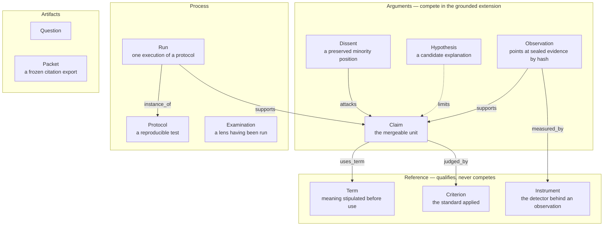
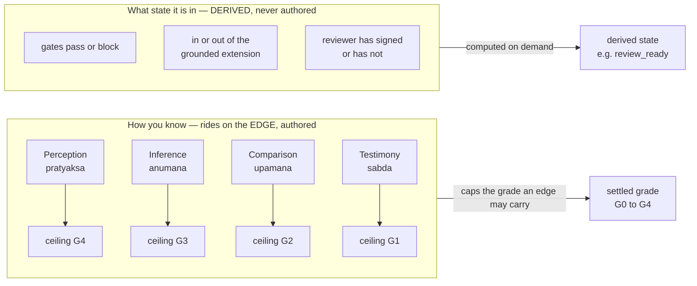
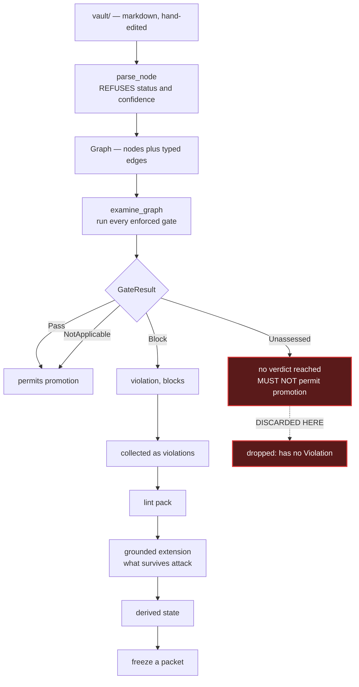
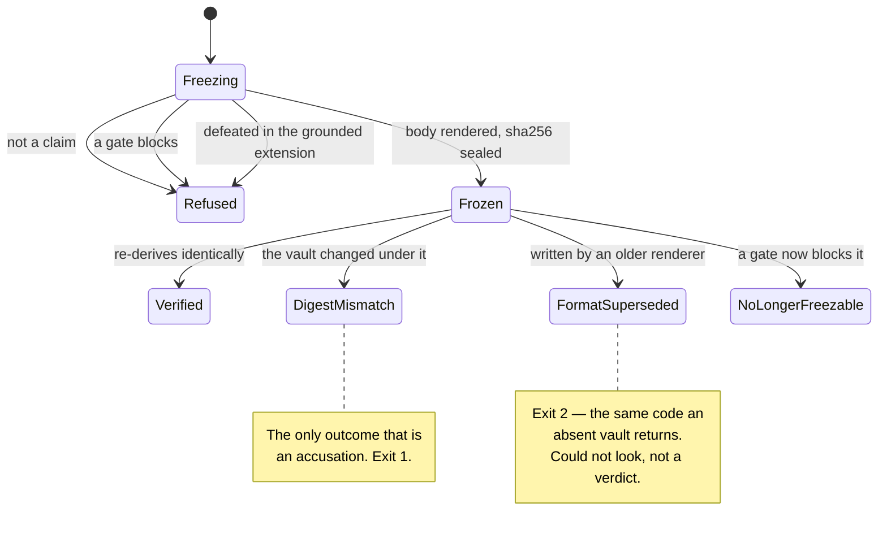

# How peira works, and where it currently does not

This document describes the system as built, and records — in the same place — what an adversarial
audit established about it on 2026-08-13. Documenting the design without the audit would be the
overstatement peira exists to prevent.

**Status of the central claim: falsified.** See [Defect register](#defect-register). The mechanism
described in [Promotion](#promotion) is correct up to the point marked, and broken after it.

---

## 1. The claim graph

Everything is a typed node in one graph. The load-bearing distinction is between nodes that make
assertions and can therefore be attacked, and nodes that qualify assertions without competing.

Two rules give the shape its force:

- **A node has no `status` and no `confidence` field.** The parser *refuses* a document carrying
  one, naming the offending key. Claim state is derived, never written.
- **A settled grade is stored inseparably from its grader.** `Edge` holds `(Grade, String)` as one
  value, so an unattributed grade is not a lint failure caught later — it is a value that cannot be
  constructed. A grade without a grader degrades to a *proposal*, which asserts nothing.

---

## 2. Two axes that are routinely conflated

Most claim-tagging schemes collapse *how you know* and *what state the claim is in* onto one axis.
peira keeps them apart, because a claim can be quoted **and** unverified at once.

The ceiling exists so that *"multiple materially independent convergent lines"* (G4) cannot be
asserted on the strength of one document someone wrote. **This is the axis the audit broke: see
defect 2.**

---

## 3. Promotion

The dashed edge is the defect. `examine_graph` keeps only `result.violation()`; `Unassessed`
produces no violation, so it never reaches `freeze`, `status` or `gates`. The method that encodes
the rule — `GateResult::permits_promotion()` — has **no production caller**.

---

## 4. Court Mode: freeze and verify

A packet is refused while any gate blocks, and while the claim is defeated. There is no override
flag. The safe statement is rendered from the graph in the 金剛經 three-moment form rather than
authored.

Reusing exit 2 for *"could not reach a verdict"* is deliberate: it is already the code for an absent
vault, and control C exists to prove *found nothing* is distinguishable from *could not look*.

---

## 5. How the claims in this document were tested

Two lineages, deliberately not one. Five agents from one model family share a blind spot and count
as **one method**; the outside critic is the second.

**The panel saturated: 25 sustained, 0 rejected.** The threshold never bound, so this run provides
no evidence that a false finding would have been rejected — no negative control was seeded. Vote
splits carry what signal there is: 16 unanimous, 7 at 4-1, 2 at 3-2.

What makes the top findings credible is not the vote count but **convergence across independent
finders**, then direct reproduction:

| Defect | Lenses finding it independently | Outside critic | Reproduced |
|---|---|---|---|
| `Unassessed` dropped | 4 of 5 | yes | yes |
| pramāṇa ceiling opt-in | 5 of 5 | yes | yes |
| safe statement authored | 3 of 5 | yes | not yet |

---

## Defect register

Twenty-five findings survived adjudication; fifteen proposed fixes drew twenty-three holes on
re-attack, so **no fix set is ready to implement**. The five that matter most:

| # | Defect | Status |
|---|---|---|
| 1 | `Unassessed` is discarded at aggregation; a packet freezes over gates that reached no verdict, asserting "All enforced gates pass" | **reproduced** |
| 2 | The pramāṇa ceiling binds only edges that declare `via=`; omit it and one edge settles at G4 | **reproduced** |
| 3 | A `retracts:` edge is accepted, recorded and ignored — the structural synonym for the refused `status: withdrawn` | **reproduced** |
| 4 | Settled grades are operationally vacuous: an ungraded, unattributed edge supports promotion as well as reviewed perception | **reproduced** |
| 5 | The generated safe statement renders author-written `stipulated:` prose verbatim | asserted, not yet reproduced |

Two smaller findings worth naming because of their shape:

- **`quantifier: all`** — an unrecognised spelling — makes the BAIMA gate `NotApplicable`. An
  unrecognised value silently disables a check instead of being shown.
- A test comment in `core/src/edge.rs` states that the gates report an undeclared pramāṇa
  "separately as unassessed". **They do not.** A comment that lies about the behaviour it documents.

### What this does not overturn

The type-level invariants hold as designed and were not falsified: the parser does refuse `status`
and `confidence`; a grade genuinely cannot be constructed without a grader; there is no override
flag on freezing; the checker runs no model. The audit's finding is narrower and worse than "the
design is wrong" — **the design is sound and the pipeline discards it.** Every defect above is a
correct rule losing its force at a join.
