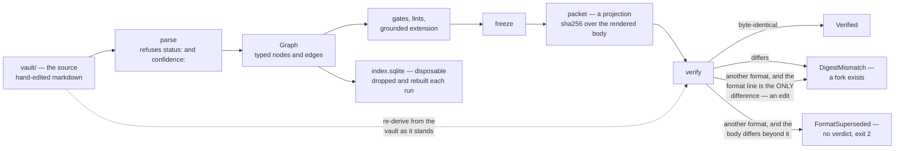
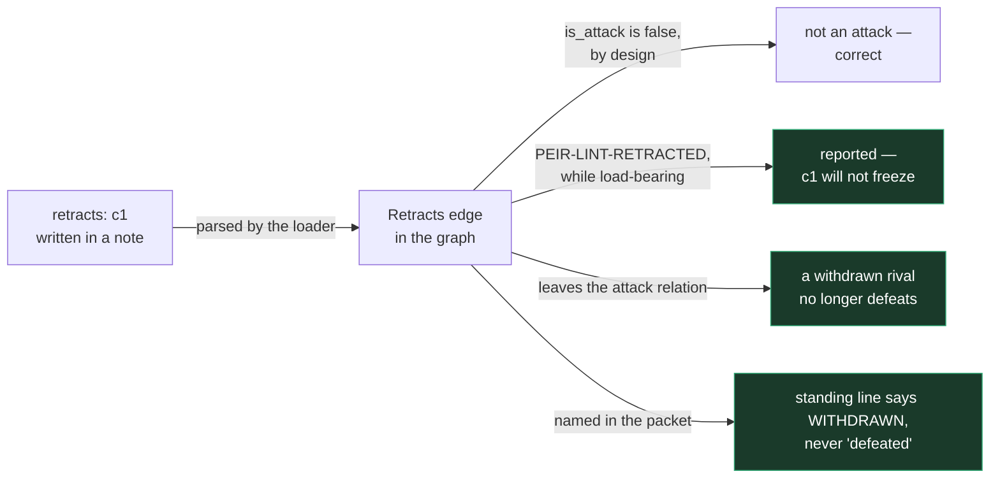
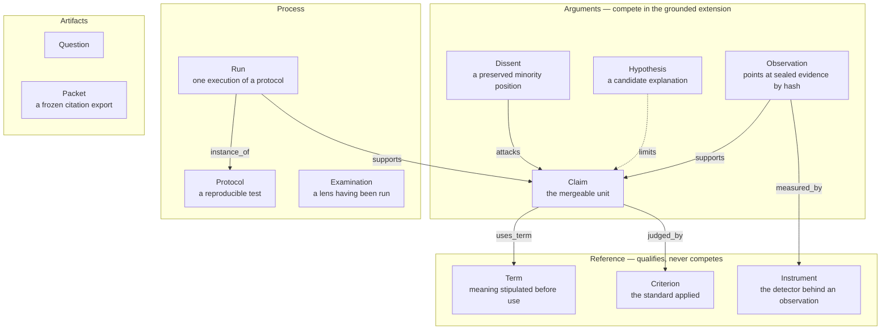
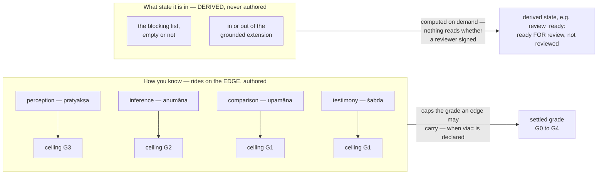
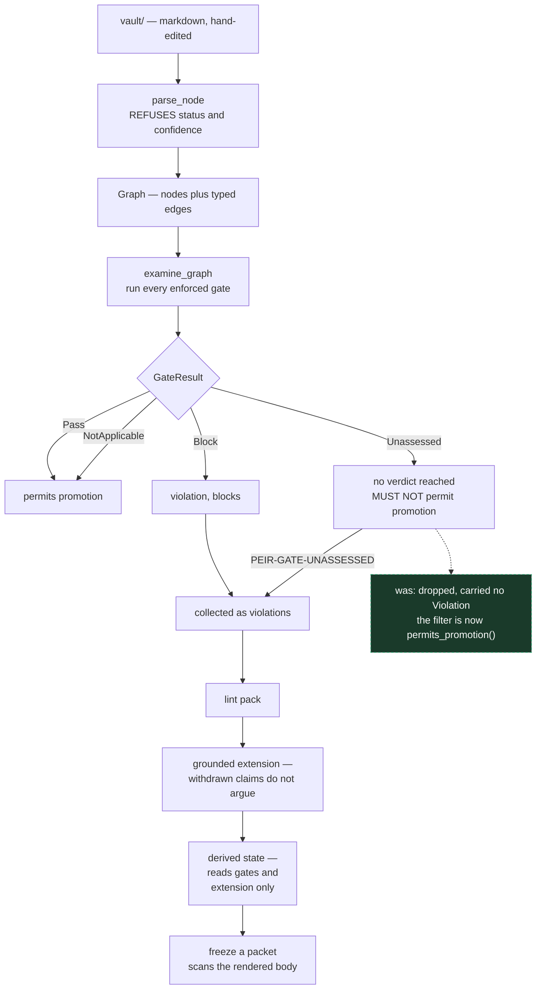
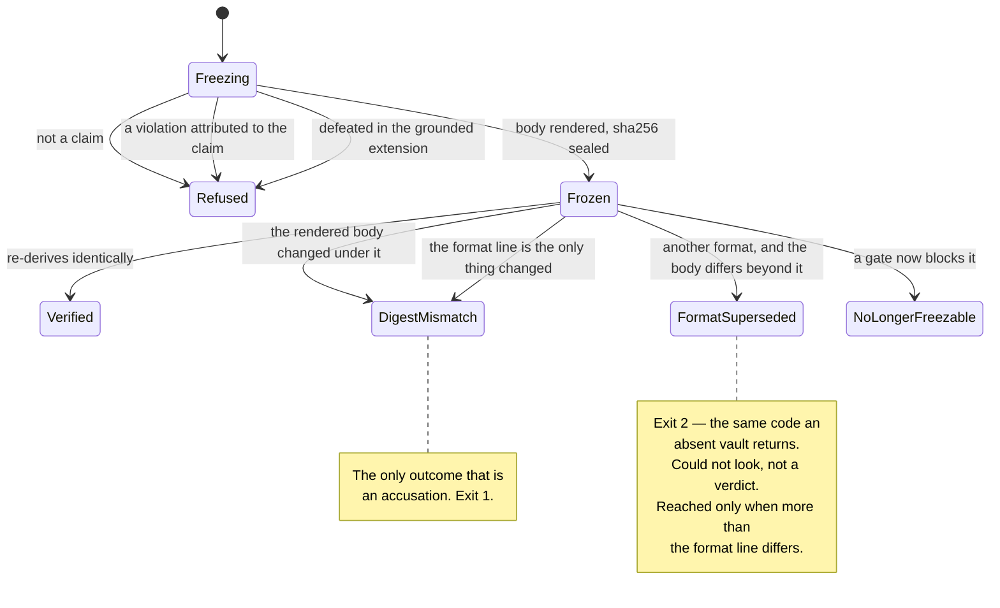
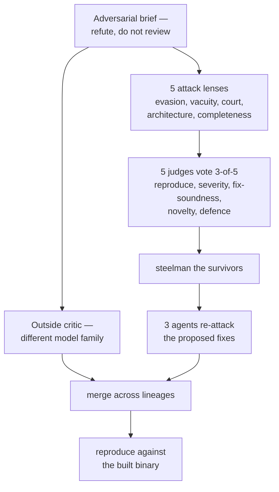

# How peira works, and where it currently does not

> The reasoning this checker enforces is written out in **[`method/`](method/)** — the six
> structures of investigative error, the claim-grading standard, the register of silently-failing
> sources, and the tribunal-reporting discipline. peira stands alone: nothing in this repository
> depends on any private configuration of its author.

This document describes the system as built, and records — in the same place — what an adversarial
audit established about it on 2026-08-13. Documenting the design without the audit would be the
overstatement peira exists to prevent.

**Status of the central claim: repaired, and re-audited six times.** An audit on 2026-08-13
falsified it — five criticals, reproduced against the binary. All five are fixed. Successive
rounds, each with a **seeded false finding as a negative control** (rejected 0-5 every time, every
judge refuting it by execution), found and closed further defects. The sixth round (2026-08-19)
ran six independent lenses plus an outside critic from another model family, deduplicated 63 raw
findings to 33, and sustained 30 of them at a 3-of-5 threshold; all 30 are fixed.

The defects that mattered most were not wrong rules. They were correct rules losing force at a
join — a verdict discarded before the decision point, a check one caller could see and another
could not, a filter that made every gate evadable by moving the content one hop up the support
chain. Round six sharpened that into a single recurring shape: **a fix that reached one copy.**
One negation rule with a second, pre-fix implementation still in use. Three readers of the
withdrawal fixed point, two of them asking the question the fix had replaced. A narrowing deleted
from two callers and alive in a third. And this documentation, where five earlier fixes had each
updated one place and left two to four others describing the behaviour that was corrected.

**Read the register as the shape of how a checker fails, not as a list of bugs.** The
counter-discipline it produced is structural: where a rule was duplicated, the duplicate is
deleted rather than corrected, because a repaired copy is still a copy.

## What you can rely on today

A register of defects without an operational boundary leaves a reader worse off than a short honest
list. This is the boundary. It is deliberately smaller than the coverage map, because the map
describes what each check *does* and this describes what its output *supports*.

**Sound enough to build on:**

- **The parser refuses authored `status:` and `confidence:`.** Claim state cannot be typed in. This
  one is structural and holds.
- **The graph and the derived index are queryable structure.** Nodes, edges, fields and grades are
  faithfully loaded, and the index answers questions over them.
- **An individual violation is a real signal to inspect.** When a gate blocks, it has found
  something. False *positives* are not the problem here.

**Not an assurance — do not rely on any of these as a verdict:**

| Output | Why not |
|---|---|
| "All enforced gates pass" | it means every gate that RAN reached a verdict and no verdict blocked. It does not mean the claim is sound, and the sentence is only as wide as the gate list |
| `review_ready` | computed from an empty blocking list and grounded membership; nothing reads whether a reviewer signed |
| grounded membership | attack edges are author-declared; standing can be manufactured |
| a verified packet | `verify` compares the rendered projection only. A format-line edit no longer demotes tampering: if the format number is the SOLE difference from the current rendering, that is an edit and is named one. Where the body differs beyond it, staleness and alteration are indistinguishable from the artifact, and `verify` says so rather than picking one |
| a mismatch as evidence of tampering | a vault that GREW and one whose evidence was ALTERED give the same verdict. `verify` names the first differing line so you can tell them apart; it cannot tell them apart for you |
| the `by=` on a grade | an unauthenticated free string. Anyone able to write the vault can attach one. The packet now DISCLOSES this and names who is credited, but peira cannot check it — the gates are pure functions of the graph, so they cannot consult the version-control history that would answer it |
| a settled grade | the ceiling binds only edges that declare a means of knowing — an undeclared one now reaches no verdict rather than passing, but a *contradicted* declaration is only reported, never corrected |
| a claim standing because a rival was withdrawn | the packet and `peira status` now DISCLOSE this — read the line; it names the withdrawn attacks rather than claiming they were defeated |
| a claim standing because a rival was DEFEATED | the defenders that produced that standing are examined now, so they are not one-line assertions — but whether the defeat is *sound* is an argument, and peira scores no arguments |
| absence of a privilege warning on a packet | the lint fires on the node carrying the material; `freeze` examines the claim's evidential closure, so a leak on a *rendered rival* is scanned as text but its own gate profile is not examined |
| the generated safe statement | it quotes author-written term fields verbatim |
| a falsifier line | rendered verbatim and NOT scanned — a falsifier must be free to name what would defeat the claim, and scanning it refused the disclosure the gates demand. It is framed rather than checked: each line carries *"Would defeat this claim:"* so it cannot be read as a finding once quoted away from its heading |

**The honest summary:** peira today is a **structured examination aid that catches specific named
mistakes**. It is not yet an assurance that a claim is safe to rely on, and no output of it should be
offered to a tribunal as though it were. Every row above is tracked in the register below.

---

## 1. The vault is the source; everything else is compiled

The discipline, stated normatively in [`method/claim-grading.md` §8](method/claim-grading.md):
findings, corrections and retractions land in the knowledge base *first*, and every report, chart
and memo is a build artifact regenerated from it. Correcting only a deliverable does not fix an
error — **it forks it**: the same fact then exists with two values, and the stale copy is the
dangerous one, because it reads as the record and gets inherited.

peira is the mechanical form of this rule. The vault is the source. `peira packet` is the
generator. `peira verify` re-derives the packet from the vault as it stands and compares
digests — which converts *"the rendered projection agrees with the record"* from a promise into a
build step. The projection is narrow and the digest covers exactly it; the fourth row below says
what is inside it and what is not.



How each half of the discipline maps onto the machinery, honestly:

| Rule | Mechanism | Status |
|---|---|---|
| Record before you report | There is no prose write path into a packet: `freeze` renders it from the graph, and the parser refuses `status:` and `confidence:` outright | **enforced** |
| Correct at the source, then rebuild | `verify` re-derives from the vault and compares digests. An edit that reaches the rendered body surfaces as `DigestMismatch`; one confined to unrendered fields — a grade, a grader, a `via=`, a `measured_by:` — changes no digest. An edit confined to the `Packet format:` line is named as the edit it is, since no older renderer could emit a body identical to today's | **enforced, narrow — defect 8** |
| Mark supersession, never silently overwrite | `supersedes:` and `retracts:` edges are read by `PEIR-LINT-RETRACTED`, by the grounded extension, and by the packet's standing line | **enforced** |
| The deliverable is a projection, never the whole | A packet renders a fixed projection: the claim's title and warrant, the ids and titles of its direct supporters, contradictors and limiters, boundaries, falsifiers, and the term moments. Grades, graders, pramāṇas and instrument links are not in it — so they are not under the digest either | by construction — **and the digest inherits the narrowness (defect 8)** |
| If it cannot be regenerated, it is not compiled — it is a fork | `Verified` means exactly: the rendered body re-derived byte-identically from the source | **enforced** |

The derived index is the same discipline in miniature: `peira index` drops and rebuilds the
database from the markdown on every run, it is gitignored, and it is never updated incrementally —
an incrementally-updated index can drift from the files it describes, and once it can drift it is a
second source of truth nobody reviewed.

### The supersession gap

The third row is the honest hole in this section. The vault can *say* that a claim is withdrawn —
`retracts:` is an edge kind, the loader builds it, and `is_attack()` deliberately excludes it so a
retraction cannot be "defended against" by a third claim. For a long time nothing else read it: the
record was kept and its meaning dropped, which is the **structural synonym** for the `status:
withdrawn` the parser refuses. Three things read it now, and the third is the one that matters —
a retraction is an *authored assertion*, so removing an attack silently would let the last writer
win. It is disclosed instead:



A packet is REFUSED for a claim the vault records as withdrawn. `subject_withdrawn` reads the
`Graph::withdrawn()` fixed point, so a retraction that has itself been retracted does not bind and
the claim stands. The structural synonym for the hand-written `status: withdrawn` the parser
refuses at the front door is now refused as an edge too:

```
PEIR-LINT-RETRACTED  c-bounded is withdrawn by `d1`, in the record it is drawn from
exit 1
```

---

## 2. The claim graph

Everything is a typed node in one graph. The load-bearing distinction is between nodes that make
assertions and can therefore be attacked, and nodes that qualify assertions without competing.



Two rules give the shape its force:

- **A node has no `status` and no `confidence` field.** The parser *refuses* a document carrying
  one, naming the offending key. Claim state is derived, never written.
- **A settled grade is stored inseparably from its grader.** `Edge` holds `(Grade, String)` as one
  value, so an unattributed grade is not a lint failure caught later — it is a value that cannot be
  constructed. A grade written without a grader degrades to a *proposal*, which asserts nothing.

---

## 3. Two axes that are routinely conflated

Most claim-tagging schemes collapse *how you know* and *what state the claim is in* onto one axis.
peira keeps them apart, because a claim can be quoted **and** unverified at once.



The derived half has exactly two inputs — the blocking list and grounded membership. `peira
status` never reads whether anyone signed; `review_ready` asserts readiness for review, not that
review happened. An empty blocking list no longer hides gates that reached no verdict:
`Unassessed` reaches the aggregation and blocks as `PEIR-GATE-UNASSESSED`.

**The ceiling refuses G4 to any single edge that declares a pramāṇa** — multiple materially
independent convergent lines are a property of the graph, not of one piece of evidence, and no
pramāṇa's ceiling reaches G4. That refusal is the entire mechanism. **Retraction:** this document
previously said a G4 "can never be asserted — only earned". Both halves were false. No graph
operation computes convergence or derives a grade from it — nothing earns G4 — and the loader
constructs a settled G4 edge directly from `grade=G4 by=…`, so the only G4 the system can hold is
an asserted one. The same false sentence stands in the doc comment on `Pramana::grade_ceiling`
(defect register).

**Omitting the declaration no longer evades it.** An edge that declares a grade and no `via=`
reaches no verdict, and no verdict blocks:

```
supports: ["c-bounded grade=G4 by=albert"]     PEIR-GATE-UNASSESSED [PRAMANA]
```

The ceiling reads `Supports` and `DependsOn` alike, so spelling the edge as a declared
prerequisite does not carry a grade past the cap either.

---

## 4. Promotion

<a name="promotion"></a>



The dashed edge **was** the central defect, and it is the shape worth remembering rather than the
bug. `examine_graph` kept only `result.violation()`; `Unassessed` produces no violation, so it never
reached `freeze`, `status` or `gates`. The method encoding the rule — `GateResult::permits_promotion()`
— had **no production caller**: every call site was a test. A claim declaring no `uses_term`, no
`quantifier` and no `causal_rung` collected three `Unassessed` results, all of which vanished, and
the packet froze stating "All enforced gates pass".

**It is now the filter.** `examine_graph` emits a `PEIR-GATE-UNASSESSED` violation for every result
where `permits_promotion()` is false, so the rule reaches the decision point and every consumer
inherits it unchanged. The lesson generalises past this defect: *a state your types model can be
discarded in transit*, and a predicate whose only callers are tests is a rule you believe you
have.

---

## 5. Court Mode: freeze and verify

A packet is refused while any violation is attributed to anything in the claim's EVIDENTIAL
CLOSURE, and while the claim is defeated in the grounded extension. There is no override flag. The
closure follows support backwards, `depends_on` forwards, the terms a packet renders, and the
DEFENDERS whose standing the claim rests on — so a violation on a supporting node blocks:

```
PEIR-LINT-LEGAL-CONCLUSION  o1: says "guilty"        (o1 supports c-bounded)
```

Rivals and limiters are deliberately NOT in it. Their titles are rendered, and `foreign_title`
withholds any that its own prose flags — the subject is not answerable for words another author
wrote and they cannot edit. The safe statement is rendered from the graph in the 金剛經
three-moment form rather than authored — see
[`method/expert-witness.md`](method/expert-witness.md) for why.



Reusing exit 2 for *"could not reach a verdict"* is deliberate: it is already the code for an
absent vault, and the acceptance controls exist to prove *found nothing* is distinguishable from
*could not look*. The packet's format number is declared inside the body `freeze` hashes, so a
re-render costs a digest change. The stored file carries no digest of its own: `verify` recomputes
one from whatever bytes are on disk and reads the declared format from those same untrusted bytes.
It used to return `FormatSuperseded` on that reading alone, which made the one accusatory verdict
the one a tamperer could opt out of — a hand edit to a single line bought "no verdict" (defect 6).

**The discriminator is in the artifact.** Correct the format number and re-compare: a body that is
then byte-identical to the current rendering was produced by *this* build, because no older
renderer emits a newer one's bytes. That is an edit, and `verify` now names it as `DigestMismatch`.
`FormatSuperseded` is reached only when the body differs beyond that line — where staleness and
alteration genuinely are indistinguishable from what the artifact carries, and saying so is the
honest answer rather than a guess.

---

## 6. Instruments: an address for the register, with no checks behind it

A recurring manufacturer of false findings is a source that answers *successfully with the wrong
thing* — the discipline, and the register it requires, are in
[`method/source-register.md`](method/source-register.md). peira gives that register an address in
the graph:

- an `instrument` node kind exists — a detector an observation came off: a tool, a query, a
  procedure someone else's software performs. Reference material, never an argument;
- a `measured_by:` edge exists, and the loader builds it, so an observation can name the
  instrument that produced it and the instrument's history travels with the evidence;
- an instrument's controls are ordinary frontmatter (`positive_control:`, `negative_control:`,
  or any key you choose), stored and queryable through the derived index.

**Two checks now read it**, and the rest of the discipline is still yours:

| check | what it enforces |
|---|---|
| `PEIR-LINT-UNCONTROLLED-INSTRUMENT` | an instrument named by an observation must declare a `positive_control:` — nothing has shown a tool fires when it should until something has |
| `PEIR-LINT-FALSE-INDEPENDENCE` | two supporters measured by the same PRODUCING instrument are one line of evidence, not two. An instrument declaring `role: verifying` is exempt; absence of the field fails safe |

Still unenforced: nothing requires an observation to declare `measured_by:` at all, and nothing
counts refusals separately from zeros. The node kind is a place to keep the register; the
discipline of keeping it is otherwise yours. The method page says what to record and when.

---

## 7. How the claims in this document were tested

Two lineages, deliberately not one. Five agents from one model family share a blind spot and count
as **one method**; the outside critic is the second.



**The panel saturated: 25 sustained, 0 rejected.** The threshold never bound, so this run provides
no evidence that a false finding would have been rejected — no negative control was seeded. Vote
splits carry what signal there is: 16 unanimous, 7 at 4-1, 2 at 3-2.

What makes the top findings credible is not the vote count but **convergence across independent
finders**, then direct reproduction:

| Defect | Lenses finding it independently | Outside critic | Reproduced |
|---|---|---|---|
| `Unassessed` dropped | 4 of 5 | yes | yes |
| pramāṇa ceiling opt-in | 5 of 5 | yes | yes |
| safe statement quotes authored prose | 3 of 5 | yes | mechanism confirmed in source; not yet run |

---

## Defect register

<a name="defect-register"></a>

Twenty-five findings survived adjudication. **All of the ones below are now fixed**, and the
register is kept as the record of what was wrong and what replaced it — a retraction is worth more
than a correction, because it is the only account of a failure mode that would otherwise repeat.
A sixth audit round (2026-08-19) is recorded after them.

| # | Defect | Status |
|---|---|---|
| 1 | `Unassessed` is discarded at aggregation; a packet freezes over gates that reached no verdict, asserting "All enforced gates pass" — and `peira status` prints the same sentence over an empty blocking list. `permits_promotion()` has no production caller | **reproduced, FIXED** |
| 2 | The pramāṇa ceiling binds only edges that declare `via=`; omit it and one settled edge sits at G4 | **reproduced, FIXED** |
| 3 | `supersedes:` and `retracts:` edges are accepted, recorded and read by nothing — the structural synonym for the refused `status: withdrawn`. A withdrawn claim still freezes | **reproduced, FIXED** |
| 4 | Settled grades are operationally vacuous: an ungraded, unattributed edge supports promotion as well as reviewed perception. The `UNREVIEWED-GRADE` lint fires only on a *proposed* grade; a wholly ungraded edge trips nothing | **reproduced, FIXED** |
| 5 | The generated safe statement renders author-written `as_used`/`not_essence`/`stipulated` prose verbatim, and the forbidden-verb lint scans only a node's title and body — never those fields | **reproduced, FIXED** — the scan now reads the rendered body before sealing, so "rendered but unscanned" is impossible rather than enumerable |

Four smaller findings worth naming because of their shape:

- **`quantifier: all`** — an unrecognised spelling — made the 白馬非馬 gate return
  `NotApplicable`, silently disabling a check instead of showing the value verbatim. **FIXED:** an
  unrecognised quantifier now reaches no verdict and blocks, naming the offending value.
- A test comment in `core/src/edge.rs` stated that the gates report an undeclared pramāṇa
  "separately as unassessed" when they did not. **FIXED in the code rather than the comment:**
  `grades_within_pramana_ceiling` now returns `Unassessed` for an undeclared means of knowing, so
  the sentence that was false has become true.
- The crate doc comment in `lens/src/lib.rs` states that domain packs "depend down onto this
  crate". **No domain pack exists.** Unbuilt architecture stated in the present tense.
- The doc comment on `Pramana::grade_ceiling` in `core/src/edge.rs` states that encoding the
  ceiling "means a G4 can never be asserted, only earned". **It can be asserted, and nothing earns
  it** — the loader constructs a settled G4 edge directly, and no graph operation computes
  convergence. A comment describing behaviour the code does not have, in the same file as the one
  above.

### Established by a second outside critique (2026-08-13)

A critique of this document against the source, from a different model family than the five-lens
panel, established four more — each checked against the code it cites before being accepted here:

| # | Defect | Status |
|---|---|---|
| 6 | `verify` read `Packet format:` from the stored body — untrusted input — and returned `FormatSuperseded`, exit 2, before any comparison. A hand edit to that one line converted *"this artifact no longer matches the record"* into *"this build cannot check it"*, so the single accusatory verdict was the one an adversary could opt out of | **CLOSED.** `verify` now normalises the format line and re-compares: if correcting the number alone makes the body byte-identical to the current rendering, the format line is the sole difference and that is an edit, reported as `DigestMismatch`. Where the body differs beyond it, staleness and alteration are genuinely indistinguishable from the artifact and it says so. The fixture asserting the old behaviour was itself wrong and was corrected |
| 7 | `freeze` blocks only on violations whose subject is the claim being frozen. A defect on a supporting node — a privilege leak, forbidden prose, a dangling edge — stops nothing unless a claim-scoped gate re-attributes it to the claim | **CLOSED.** `violations_for` walks the evidential closure, and `evidential_closure` is now the single public definition all three commands scope by |
| 8 | The digest covers only the rendered projection. Grades, graders, pramāṇas and `measured_by:` links are not rendered, so they change in the vault without disturbing a frozen packet; the change surfaces only if it now trips a gate, as `NoLongerFreezable` — otherwise `Verified` | **confirmed in source** |
| 9 | The loader silently degrades malformed edge metadata: an unknown attribute key, an invalid `grade=` and a misspelt `via=` are dropped without a diagnostic | **PARTLY CLOSED, and the consequences named here no longer follow.** A misspelt `via=` leaves the edge with no declared means of knowing, which now reaches no verdict and blocks as `PEIR-GATE-UNASSESSED [PRAMANA]`; a mangled `grade=` leaves the edge ungraded, which `PEIR-LINT-UNGRADED-SUPPORT` reports. The loader is still silent about the typo itself — it says the edge is unexamined, not that a word was misspelt |

### The sixth audit (2026-08-19)

Six independent lenses plus an outside critic from a different model family produced 63 raw
findings, deduplicated to 33 distinct defects. Five judges re-derived each one against the binary;
the threshold was 3 of 5.

**A fabricated finding was seeded into the docket and rejected 0-5**, every judge naming the
mechanism — `is_attack()` excludes `Limits`, so the alleged rendering could not occur. Three went
further and noticed the cited line number falls inside a different function. Five real findings
were also rejected on the merits, including two this document's author had expected to sustain.

The round's dominant shape was **a fix that reached one copy**: one negation rule with a second,
pre-fix implementation still in use; three readers of the withdrawal fixed point, two of them
asking a direct-edge question; a subject-scoping narrowing deleted from two callers and alive in a
third; and this documentation, where five earlier fixes had each updated one place and left two to
four others describing the pre-fix behaviour.

| # | Defect | Status |
|---|---|---|
| 10 | `is_negated` inspected only the FIRST occurrence of an overstatement, so an earlier hedged mention licensed every later bare one into a sealed packet. The per-occurrence rule existed in `clause_negated` and never reached this copy | **FIXED** — `is_negated` deleted; both callers use the one rule |
| 11 | Three readers of `Graph::withdrawn()`, two using a direct-edge test, so `status` and `packet` gave opposite accounts of a restored attack and a lifted retraction blocked a live supporter forever | **FIXED** — `withdrawn_attacks` is one public function in court |
| 12 | The examined closure followed support while GROUNDING was decided by the attack relation it never visited, so one unexamined line could neutralise any live rival and reinstate an over-claimed conclusion | **FIXED** — the closure follows defenders; attackers stay out, so the subject is not answerable for opposition |
| 13 | `attackers()` accepted an attack from any node, so a `term` — reference material `is_argument` says never competes — defeated a claim | **FIXED**, and the discarded edge is reported rather than silently dropped |
| 14 | A rival's title blocked the packet quoting it when spelled `contradicts:` and was disclosed when spelled `attacks:` — the same words, the outcome decided by edge spelling | **FIXED** — `foreign_title` is the one renderer for prose the subject did not write |
| 15 | `clause_has_party` matched party words as SUBSTRINGS, so "the" contained "he" and any sentence with an article plus an ultimate-issue word read as a verdict about a person — including this project's own worked example of what must never fire | **FIXED** |
| 16 | `Sublates` — "preserves the target while superseding it" — was parsed, listed as a known kind, and read by nothing, so the identical lifecycle statement sealed in silence under one spelling and was refused under the other | **FIXED** |
| 17 | Four production rules had no test that could fail, and three more asserted only negatives or ran on degenerate fixtures. Neutering `subject_withdrawn` with `if true \|\|` left the whole suite green | **FIXED** — each proved by the mutation that motivated it |

Sustained findings this round that were **rejected**, and why they are worth recording: an
`establishes` finding (the substitution table's own sanctioned replacement for "proves"), a
`no_terms_of_art` finding (absence fails safe; declaring it is an accountable act), and three
others where real behaviour was working as designed. A panel that sustains everything has
established nothing.

### The second audit, and what it changed about method

The first audit's panel **sustained 25 of 25 findings** — the 3-of-5 threshold never bound, so
nothing established that a bad finding would have been rejected. The second seeded a plausible
falsehood into the docket and told the judges one was fabricated. It was rejected **0-5**, every
judge refuting it by running the binary. That number is why the second round's findings carry
weight the first round's counts did not.

**All three of the previously-open findings are now closed**, and the closing changed two of them:

| Was open | Outcome |
|---|---|
| A support hop through a `hypothesis` reaches fewer gates | **fixed** — promotion obligations attach to being *load-bearing*, not to the node kind. A hypothesis nothing leans on is still a candidate; one supporting a claim answers for itself |
| `verify` cannot know about a retraction added after freezing | **was already closed** by the evidential-closure walk, and this document was stale. `verify` re-derives from the live vault, so it reports "the claim no longer qualifies" and names the retraction. The *packet* is ignorant; the *tool* is not |
| The forbidden-verb list is finite | **the panel rejected this 1-4 and the panel was half right.** A denylist being finite is not a defect. But *"the suspect is guilty of unauthorised access"* contains no forbidden verb, passed every check, and froze into a packet — so `PEIR-LINT-LEGAL-CONCLUSION` now catches the ultimate issue, which unlike overstatement is a closed vocabulary |

The layer-3 lint uses **sentence-level** negation rather than the verb lint's short lookback, and the
trade costs real coverage: *"X is guilty, and nothing contradicts it"* is missed because it contains
a negator. That is the right direction for a check that blocks — a false positive here refuses the
carefully hedged sentence an expert is obliged to write, and what it misses was caught by nothing
before.

**Only one lineage ran the second round.** The outside critic was blocked by its provider's safety
classifier — the session shape (an agent building a tool, then constructing inputs to defeat its
checks) reads as offensive tooling regardless of wording. Its transcript shows it started and was
killed mid-run, so that is a refusal, not a null result, and these findings lack the cross-lineage
convergence the first round's had.

### What this does not overturn

The type-level invariants hold as designed and were not falsified: the parser does refuse `status`
and `confidence`; a grade genuinely cannot be constructed without a grader; there is no override
flag on freezing; the checker runs no model. The audit's finding is narrower and worse than "the
design is wrong" — **the design is sound and the pipeline discards it.** Every defect above is a
correct rule losing its force at a join.
