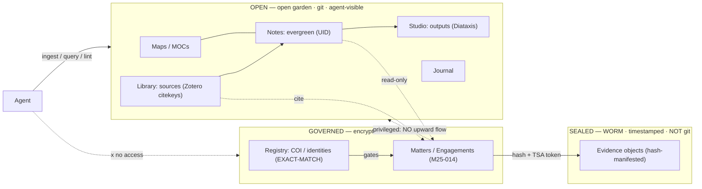

# OGS — Open · Governed · Sealed (a better-than-PARA method)

*Formerly ADC (Atlas · Docket · Custody). Renamed to the general OGS tier names: the
**Governed** tier holds expert-witness matters **and** consulting/vCISO engagements **and**
business admin — not only legal dockets — so a legal-specific name mislabelled it.*

**This is the OGS vault as instantiated for a scholar-practitioner.** The concise spec is
[`spec.md`](spec.md); this file is the full structure — Johnny.Decimal areas, typed
frontmatter, lint rules. It uses the general OGS tier names directly; other domains may
rename their tiers (see the reference-profiles table in the spec).

Full raw report in [`sources/research-adc-method.md`](sources/research-adc-method.md). Tags:
**[verified]** primary-source-checked · **[synthesis]** the OGS construction itself.

---

## Definition

OGS organizes by **object lifecycle and trust zone**, not by actionability the way PARA
does. An *evergreen idea* (never "done", grows by linking) and a *bounded matter* (opens →
worked → closed → retained/destroyed) are different objects that must not share a shape, so
each gets its own store. Ideas, sources, and outputs live in the **Open** tier (a git-backed
digital garden: Zettelkasten + Maps of Content); privileged casework lives in a physically
separate, access-controlled **Governed** tier (matter/engagement-centric, exact-match COI
registry); evidence lives in the **Sealed** tier — write-once, *not markdown and not git*
(WORM + trusted timestamping). Typed frontmatter + stable coordinates (Johnny.Decimal for
bounded/reference objects, UID + associative links for the idea graph) make the whole thing
agent-addressable, while a one-way membrane keeps privileged facts from flowing up into the
shareable garden. [synthesis]

**Teachable rule:** *Ideas go in Open, matters and engagements go in Governed, evidence goes
in Sealed — never conflate the three.*

## Zone diagram



## Structure, IDs, frontmatter

### Open — the open garden (Johnny.Decimal areas)

Johnny.Decimal caps at 10 areas × 10 categories × 100 IDs in `AC.ID` notation (e.g.
`11.02`) [verified — johnnydecimal.com].

| Area | Layer | Addressing | Borrowed from |
|---|---|---|---|
| `00-09` | **Meta** — templates, MOC index, lint config, vocab | JD `AC.ID` | — |
| `10-19` | **Maps** — MOCs, traversal hubs | JD `AC.ID` | Milo (Atlas) [verified] |
| `20-29` | **Notes** — evergreen permanent notes | **UID** `YYYYMMDDHHmm`, flat | Matuschak / Doto / Luhmann [verified] |
| `30-39` | **Library** — literature notes | **citekey** (`dror2006contextual`) | Zotero + Better BibTeX [verified] |
| `40-49` | **Studio** — outputs (report/paper/talk/course) | JD `AC.ID` + `diataxis:` | Diátaxis [verified] |
| `50-59` | **Journal** — daily/periodic | date | Milo (Calendar) [verified] |

**Addressing split [synthesis]:** ideas in `20-29` use **UID + associative links, not
Johnny.Decimal**, because the evergreen discipline is explicitly anti-hierarchical
(foldering ossifies ideas; projects/tasks live *outside* the note graph). Johnny.Decimal
earns its place for bounded/reference objects (Maps, Library, Studio, all of Governed) where
a stable coordinate is the point.

### Governed — confidential casework (closed, physically separate, encrypted)

Holds **more than legal matters** — expert-witness cases, consulting/vCISO engagements, and
business admin all share the Governed tier's handling rules (exact-match COI gate,
least-privilege, encryption). That breadth is why the tier is named for its *posture*
(governed), not for one domain's artifact (a docket).

| Area | Layer | Addressing |
|---|---|---|
| `00-09` | **Registry** — COI list, client/party identities, conflict-check log | exact-match records |
| `10-19` | **Matters — expert-witness** | matter ID `M{YY}-{NNN}`, never reused |
| `20-29` | **Engagements — consulting / vCISO** | engagement ID `E{YY}-{NNN}` |
| `30-39` | **Business admin** (contracts, invoices) | JD `AC.ID` |

Each matter/engagement is a fixed sub-structure (legal/forensic DMS practice):
`M25-014/` → `00-intake/` · `10-evidence-log/` · `20-analysis/` · `30-working/` ·
`40-output/` · `50-admin/`. The `10-evidence-log/` holds a **register only** (filenames,
hashes, Sealed-tier pointers) — never evidence bytes.

### Sealed — evidence (outside the note system)

Evidence objects on **WORM / write-once** storage, each with a SHA-256+ manifest and an
**RFC 3161 trusted-timestamp token**. Deliberately *not markdown, not git*, because
**markdown + git is version history, not chain of custody** (git is rebase-mutable and
carries no trusted time anchor). The Governed tier references each object by
`hash + TSA token`; note hygiene and evidence integrity stay separate by construction.
[synthesis, respecting the stated hard constraint]

### Required typed frontmatter (agent-lintable)

Common: `id`, `type`, `title`, `zone`, `created`, `updated`, `status`, `tags`.

```yaml
# note (Open 20-29)
id: 202607241412
type: note
maturity: seedling | budding | evergreen
moc: ["[[11.03 Forensic-decision MOC]]"]
srs: true

# source (Open 30-39)
type: source
citekey: dror2006contextual
doi: 10.1016/j.forsciint.2005.10.017

# matter (Governed 10-19) — never in the Open tier
type: matter
matter_id: M25-014
zone: governed
privilege: true
client: "[[00.02 Client-Northgate]]"     # Registry ref, exact-match
role: expert-witness                       # consultant | vciso
status: intake|active|reporting|closed|retention
coi_checked: 2026-06-30
retention_until: 2033-06-30
evidence_store: sealed://M25-014/          # pointer, not content

# output (Open 40-49)
type: output
diataxis: explanation                      # tutorial|how-to|reference|explanation
status: draft|review|published
```

**Lint rules (agent-enforced):** every note has `id`/`type`/`updated`; every matter has
`coi_checked` + `retention_until` + `privilege: true`; **no `client`/`privilege` field may
appear in the Open tier** (structural leak block); every `citekey` resolves to a Library
note; every MOC link resolves.

## Two worked lifecycles (why the split matters)

- **A matter** (`M25-014`, *Northgate v. Someone*): COI check against the Registry *before*
  opening → matter folder with `retention_until` → evidence to Sealed (hashed + timestamped),
  a register row in Governed → analysis may cite Open read-only → report → close →
  retention → destruction date. **Bounded lifecycle.**
- **A research thread** (*cognitive bias in forensic examiner decisions*): Zotero mints a
  citekey → Library note → atomized evergreen Notes (UID, `srs: true`) → a MOC gives
  traversal → composed into a Studio output. **Never closes; no matter ID, no Sealed.**

The opposite lifecycles are the whole point — PARA would file both as "Project"/"Resource"
and flatten them.

## Why it beats PARA for this person

- PARA sorts by **actionability only** — no home for a matter's lifecycle or an evergreen
  idea. [verified — fortelabs.com/blog/para: PARA is "all about action," no knowledge layer.]
- OGS adds a first-class **knowledge/idea layer** (Open) + **literature layer** (Library)
  the research side needs.
- OGS makes practitioner constraints **structural**: separate encrypted Governed tier,
  exact-match Registry gating every matter, a Sealed tier that refuses to conflate notes
  with evidence.
- OGS is **agent-addressable**: typed frontmatter + Johnny.Decimal + MOC hubs + lint rules +
  least-privilege (agent sees Open only).

## Migration from the 994-note PARA vault (sketch, not a task list)

`classify → separate → enrich → lint`: (1) inventory & classify by inferred `type`;
(2) **separate the Governed tier first** (anything with client/party/privilege leaves the
Open tier into the encrypted Governed tier; build the Registry; point evidence at Sealed —
never import bytes); (3) map buckets (Areas → MOCs, source-backed Resources → Library,
idea-dumps *atomized over time* into Notes, Archive → Governed retention); (4) enrich
frontmatter/IDs; (5) lint — hard gate: **zero `privilege`/`client` fields left in Open**
before wiring the agent.

## Honest caveats (from the researcher)

- **OGS itself is [synthesis]** — a construction, not a citable existing scheme; its tiering
  inherits from information classification, only the personal-KM structural enforcement is new.
- The **"ACCESS" PARA variant did not verify** (CODE = Capture/Organize/Distill/Express did).
- Milo's framework is **ACE = Atlas / Calendar / Efforts** [verified] (not "Cards").
- Better BibTeX and FSRS citations rest on prior knowledge, not a same-session click-through.

## Sources

fortelabs.com/blog/para · johnnydecimal.com/documentation/areas-and-categories ·
blog.linkingyourthinking.com/notes/ace-folder-framework · notes.andymatuschak.org/Evergreen_notes ·
writing.bobdoto.computer/zettelkasten · diataxis.fr · getbetterbibtex (retorque.re) ·
github.com/open-spaced-repetition/fsrs
