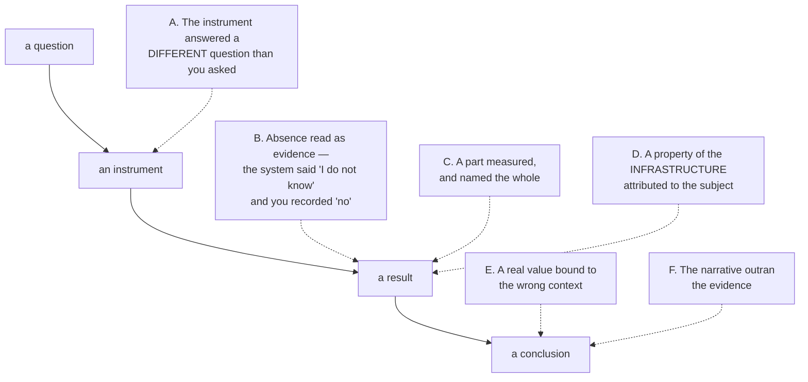
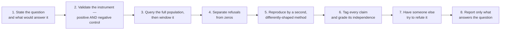

# The discipline peira mechanises

peira is a checker. This directory is the reasoning it checks *for*, written out so the tool is
usable by someone who has never met its author. Nothing here depends on any private configuration.

Distilled from forensic and investigative practice — most of it from defects that reached, or
nearly reached, a client. The instances are domain-specific and will not recur; the **shapes** do.

| | |
|---|---|
| [`claim-grading.md`](claim-grading.md) | the normative standard: tags, independence tiers, source classes, instrument validity, the compiled-deliverable rule, confidence expression |
| [`source-register.md`](source-register.md) | sources that fail silently: the register, its ownership split, and the controls |
| [`expert-witness.md`](expert-witness.md) | least disclosure, the three epistemic layers, the overstatement substitution table |
| this file | the six structures of investigative error, the controls, and **what peira actually enforces** |

---

## The controlling idea

> **Care is not a control. A control is something that can go red, and it must be shown to do so.**

An examiner who is being careful and an examiner who is being fooled produce the same subjective
experience. The difference is external: a check that fails on a known-bad input, run before the
conclusion is trusted.

---

## The six structures of investigative error

The set is not closed. Learn the shapes.

**A — the instrument answered a different question.** You asked Q; the tool answered Q′; Q′
returned a plausible value. A filter on a field that does not exist returns zero every time.
*Defence: build the control from the **same expression** as the query, varying only the input. A
control that exercises part of the selector certifies only that part.*

**B — absence read as evidence.** Refusals counted as zeros. A total assembled only from the
queries that **succeeded**, when the ones that refused were the busy ones.
*Defence: a refusal is a **third state**. Count it, carry it into the artifact, and make any claim
resting on completeness **assert** that refusals are zero rather than assume it. The sources that
manufacture this error are catalogued in [`source-register.md`](source-register.md).*

**C — a part measured and named the whole.** A windowed query's own edge read as the start of a
behaviour. A sample drawn only from the pages that did not hit the cap.
*Defence: query the full population first, then window it. State the denominator. **A cap yields a
floor, never a total.***

**D — infrastructure attributed to the subject.** The plumbing left a trace and you credited it to
the actor: a relay that broadcasts on someone's behalf, a gateway named as the user in a protocol
event, a registrar every registration passes through.
*Defence: before attributing an action, ask what intermediary would leave the same trace.*

**E — a real value bound to the wrong context.** A figure read correctly from the right source and
attached to the wrong instant, subject, or unit. No lineage check sees it: the number genuinely
came from the data.
*Defence: every stored figure carries **subject, instant and unit**. Drop any one and the value
survives while its meaning does not.*

**F — the narrative outran the evidence.** The most dangerous, because it is invisible from
inside. Each claim inherits credibility from the story around it rather than from anything
observed.
*Defence: ask of each claim whether its support reaches the world, or only more claims.*

---

## Negative and alarming findings get MORE scrutiny, not less

A negative finding — *"no evidence of X"*, *"cannot be determined"*, *"nothing was found"* — looks
unfalsifiable, and therefore attracts **less** challenge than a positive one. That asymmetry is
backwards.

**Every zero is a possible instrument failure until the instrument has been shown to fire on a
known positive.** A Type II error in the instrument becomes a Type I error in the conclusion: a
silent miss does not stay silent, it is promoted into a confident positive claim about absence —
and it is confident *precisely because* the search found nothing.

The same applies to an asserted impossibility. *"That cannot be determined"* receives less
scrutiny than an asserted fact because it looks like a closed question. Re-test claimed
impossibilities first; they are the cheapest wins available.

---

## The record is the source; deliverables are compiled

The second discipline this directory exists to carry, stated in full in
[`claim-grading.md` §8](claim-grading.md) and mapped onto the machinery in
[`../architecture.md` §1](../architecture.md): findings, corrections and retractions land in the
knowledge base first, and every deliverable is a build artifact regenerated from it. A correction
applied only to a deliverable does not fix an error — it forks it. peira is the mechanical form of
this rule: the vault is the source, `peira packet` is the generator, and `peira verify` re-derives
and compares digests. Two limits the audits established: supersession is recorded without being
honoured, and the digest covers only the packet's rendered projection — see the coverage map
below.

---

## What peira actually enforces

Honest coverage. A discipline shipped without this table would be the overstatement peira exists
to prevent.

| Rule | Mechanised as | Status |
|---|---|---|
| A judgement declares the standard it is judged by | `PEIR-CRITERION-UNDECLARED` (立極) | **enforced** ⁴ |
| Load-bearing terms are stipulated before use | `PEIR-TERM-UNSTIPULATED` (正名) | **checked when declared** ⁴ |
| What a thing *did* is not what it *is* | `PEIR-FUNCTION-AS-SUBSTANCE` (體用) | **checked when declared** ⁴ |
| A universal quantifier declares its extension | `PEIR-CLASS-EXTENSION-UNDECLARED` (白馬非馬) | **checked when declared** ⁴ |
| A contested question addresses all four corners | `PEIR-CORNERS-UNADDRESSED` (四句) | **enforced** |
| The rule licensing grounds → claim is written down | `PEIR-WARRANT-MISSING` (Toulmin) | **enforced** |
| Evidence grade is capped by means of knowing | `PEIR-GRADE-EXCEEDS-PRAMANA` (pramāṇa) | **enforced, evadable** ¹ |
| A causal claim earns its rung | `PEIR-CAUSAL-RUNG-UNREACHED` (Pearl) | **checked when declared** ⁴ |
| A claim states where it holds | `PEIR-BOUNDARIES-MISSING` | **enforced** |
| A claim states what would defeat it | `PEIR-FALSIFIER-MISSING` (Popper / premortem) | **enforced** |
| What survives attack is computed, not asserted | grounded extension (Dung) | **enforced** |
| A claim with no support at all is flagged | `PEIR-LINT-ORPHAN-CLAIM` | **enforced** |
| Support must reach the world, not only more claims | `PEIR-LINT-UNGROUNDED-CHAIN` | **enforced** |
| Overstated verbs are flagged, with the safe form named | `PEIR-LINT-FORBIDDEN-VERB` | **enforced, partial** ² |
| A grade nobody stands behind asserts nothing | `PEIR-LINT-UNREVIEWED-GRADE` | **enforced, narrow** ⁵ |
| Who settled a grade is recorded, not established | the packet's *Provenance of the grading* section | **disclosed, unverifiable** ¹³ |
| Authors do not sign off their own findings | `PEIR-LINT-SELF-GRADED` | **checked when declared** ⁶ |
| Restatements are not corroboration | `PEIR-LINT-FALSE-INDEPENDENCE` | **enforced, narrow** ³ |
| A window's edge is not the start of a behaviour | `PEIR-LINT-WINDOW-EDGE-AS-ONSET` | **enforced** |
| A reference that goes nowhere is a defect | `PEIR-LINT-DANGLING-EDGE` | **enforced** |
| A finding does not decide the tribunal's question | `PEIR-LINT-LEGAL-CONCLUSION` | **enforced, heuristic** ¹⁰ |
| A declaration the claim's own words contradict | `PEIR-LINT-DECLARATION-CONTRADICTED` | **enforced, heuristic** ¹¹ |
| Privileged material stays out of the open tier | `PEIR-LINT-PRIVILEGE-LEAK` | **flagged, not withheld** ⁹ |
| **A deliverable is compiled from the record and re-derivable** | `peira packet` / `peira verify` — digest re-derivation | **enforced for the rendered projection** ⁷ |
| A withdrawn or replaced claim is not citable | `PEIR-LINT-RETRACTED` | **enforced** |
| **An unrecognised value goes red, never silently interpreted** | — | **violated by the loader** ⁸ |
| **An observation names the instrument it came off** | `measured_by:` edge to an `instrument` node | **expressible; provenance not required** ¹² |
| **Two readings from one instrument are one line** | `PEIR-LINT-FALSE-INDEPENDENCE` | **enforced** |
| **An instrument nobody has shown to work cannot certify a null** | `PEIR-LINT-UNCONTROLLED-INSTRUMENT` | **enforced when declared** ¹² |
| **Instrument validity: positive and negative controls** | `instrument` node fields | **node only, no checks** |
| **Refusal counted separately from zero** | — | **not mechanised** |
| **A cap yields a floor, never a total** | — | **not mechanised** |
| **Extraordinary claims need extraordinary evidence** | — | **not mechanised** |
| **The prosecutor's fallacy** | — | **not mechanised** |
| **Custody and pedigree of an observation** | — | **not mechanised** |
⁹ The lint reports a leak on the node that carries it. `freeze` filters violations to the claim's
own id, so a privilege leak on a *supporting* node does not stop a packet — and the packet renders
that supporter's id and title. Flagging is not exclusion; read the lint output before exporting.

¹³ `by=` is a free string and peira cannot check it: the gates are pure functions of the graph —
no I/O — so they cannot consult the version control that would answer who wrote an edge. The packet
names who is credited and states plainly that the attribution is self-declared, which is this tool's
answer everywhere it cannot establish something.

¹² Recording an instrument is still optional — demanding provenance on every observation would be
ceremony, and ceremony is routed around. What is enforced is that a recorded instrument must carry a
`positive_control:`, and that two supporters sharing one instrument are one line. Both fire only for
authors who wrote a `measured_by:` edge, so the discipline rewards recording rather than punishing it.

¹¹ The gates trust `quantifier:` and `causal_rung:` because an author knows what a claim asserts —
but a claim saying "on every host" while declaring `quantifier: singular` switches 白馬非馬 off by
declaration rather than by argument. This reports the DISAGREEMENT between two things the author
supplied; it does not decide which is right. Strong causal markers only: "produced" was tried and
removed as ordinary forensic description.

¹⁰ A closed list of ultimate issues — unlike overstatement, the questions a tribunal decides are
finite. Skipped entirely when the sentence contains any negator, so a careful negative finding
("not evidence that X is liable") passes; the cost is that "X is guilty, and nothing contradicts it"
is missed. T3 instrument: our own table, not a decode of anyone's spec.

¹ The ceiling binds only edges that declare a means of knowing; omitting the declaration evades it.
² The lint reports; it rewrites nothing — the safe form travels in the violation's detail line. It
scans a node's title, body and the three term moments; the warrant and boundaries are covered
instead by the scan `freeze` runs over the FINISHED packet body, which is what makes "rendered but
unscanned" structurally impossible rather than a list to keep in step by hand. **Falsifiers are the
one exception, and deliberately:** a falsifier NAMES what would defeat the claim, so scanning it
refused *"evidence that the entry was forged and the transfer fraudulent"* — precisely what
`PEIR-FALSIFIER-MISSING` demands — for containing the words it was required to contain. The section
is excluded from the scan; each line instead carries the prefix *"Would defeat this claim:"*, so a
line lifted out of the packet keeps the sense the heading gave it.
³ Fires only where one supporter is explicitly marked as duplicating another; it does not detect
two supporters that share an instrument or a source.
⁴ Reaches a verdict only when the claim declares the triggering field (`uses_term`, `quantifier`,
`causal_rung`, `aspect`, an evaluative word or `evaluative: true`). With the field absent the gate
returns `Unassessed`, which now BLOCKS as `PEIR-GATE-UNASSESSED` — silence no longer passes. A
field declared *falsely* is a different matter and is reported by
`PEIR-LINT-DECLARATION-CONTRADICTED`, which compares the declaration against the claim's own words.
⁵ Fires only on a *proposed* grade with no reviewer. An edge carrying no grade at all is caught
separately by `PEIR-LINT-UNGRADED-SUPPORT`, on claims and on any hypothesis something leans on.
⁶ Compares the grader against `author:` only when the claim declares one; with `author:` absent
there is nothing to compare and the lint reports nothing.
⁷ The digest covers the packet's rendered body only. Grades, graders, pramāṇas and `measured_by:`
links are not rendered, so they change without disturbing it — architecture defect 8.
⁸ The loader drops an unknown edge attribute, an invalid `grade=` and a misspelt `via=` without a
diagnostic; a typo removes the pramāṇa ceiling or the review semantics instead of going red —
architecture defect 9.

## The ten that are catalogued and enforce nothing

Named, sourced, given a worked example — and owning no gate. A meta-test asserts that a catalogued
lens has none, so the catalogue cannot quietly imply an examination it does not perform. Listed in
full because a reader would otherwise have no way to tell an omission from a deliberate deferral.

| Lens | | The failure it names |
|---|---|---|
| `ELENCHUS` | ἔλεγχος elenchus — Socratic Cross-Examination | premises that were never examined because nobody asked |
| `ACH` | Analysis of Competing Hypotheses | confirmation by consistency — collecting evidence that fits the favoured hypothesis without asking what it rules out |
| `PANCAVAYAVA` | पञ्चावयव pañcāvayava — The Five-Membered Argument | a reason that looks valid but is unestablished, contradictory, inconclusive, counterbalanced, or already defeated |
| `STEELMAN` | Rapoport's Rules — Steelman First | attacking a position its holder would not recognise |
| `DOUBLECRUX` | Double Crux | disagreement that circles because the load-bearing belief was never located |
| `MACHLOKET` | מחלוקת machloket — Preserve the Minority | deleting the losing argument, so the reasoning that rejected it becomes unreviewable |
| `AUFHEBUNG` | Aufhebung — Synthesis That Preserves | a synthesis that quietly discards what it claimed to reconcile |
| `THESEUS` | Ship of Theseus — Amend or Supersede | silent identity drift: a claim's meaning changes across edits while its id, and everything citing it, stays put |
| `CHESTERTON` | Chesterton's Fence | removing something without recovering why it was put there |
| `ERDI` | 二諦 — The Two Truths, and Court Mode | a courtroom sentence that asserts more than the graph behind it supports |

**Socratic questioning is here, not missing** — `ELENCHUS`, with its six question families. So are
competing-hypothesis analysis (`ACH`) and the preservation of rejected alternatives (`MACHLOKET`).
Each is specified and unmechanised: read them as a reading list for what to ask by hand, not as
checks the tool performs.

**Ten of twenty catalogued lenses are enforced.** A lens marked catalogued owns no gates, and a
meta-test asserts that — so the catalogue cannot quietly imply an examination it does not perform.

See [`../architecture.md`](../architecture.md) for the defects an adversarial audit found in the
enforced set. Several rules above are correct in the code and lost at an aggregation point.

---

## The operating sequence

Steps 2, 4 and 5 are the ones habitually skipped, and they are where the defects live.

---

## Two ideas that carry more weight than their length

**Review and refutation are different instruments.** A reviewer handed a document spreads
attention across it and tends to *restate* rather than re-test. A refuter handed **one claim**,
told to attack it, and given named lines of attack, spends everything on that claim. If you want a
finding tested, scope the task to the finding and say *refute*, not *review*.

**Verify the critic.** A hostile reviewer overstates too. Reviewer findings are quoted material
until checked — treat them exactly as you would any other secondary source.
