# The discipline peira mechanises

peira is a checker. This directory is the reasoning it checks *for*, written out so the tool is
usable by someone who has never met its author. Nothing here depends on any private configuration.

Distilled from forensic and investigative practice — most of it from defects that reached, or nearly
reached, a client. The instances are domain-specific and will not recur; the **shapes** do.

| | |
|---|---|
| [`claim-grading.md`](claim-grading.md) | the normative standard: tags, independence tiers, source classes, instrument validity, confidence expression |
| [`expert-witness.md`](expert-witness.md) | least disclosure, the three epistemic layers, the overstatement substitution table |
| this file | the six structures of investigative error, the controls, and **what peira actually enforces** |

---

## The controlling idea

> **Care is not a control. A control is something that can go red, and it must be shown to do so.**

An examiner who is being careful and an examiner who is being fooled produce the same subjective
experience. The difference is external: a check that fails on a known-bad input, run before the
conclusion is trusted.

---

## The six structures of investigative error

The set is not closed. Learn the shapes.

**A — the instrument answered a different question.** You asked Q; the tool answered Q′; Q′ returned
a plausible value. A filter on a field that does not exist returns zero every time.
*Defence: build the control from the **same expression** as the query, varying only the input. A
control that exercises part of the selector certifies only that part.*

**B — absence read as evidence.** Refusals counted as zeros. A total assembled only from the queries
that **succeeded**, when the ones that refused were the busy ones.
*Defence: a refusal is a **third state**. Count it, carry it into the artifact, and make any claim
resting on completeness **assert** that refusals are zero rather than assume it.*

**C — a part measured and named the whole.** A windowed query's own edge read as the start of a
behaviour. A sample drawn only from the pages that did not hit the cap.
*Defence: query the full population first, then window it. State the denominator. **A cap yields a
floor, never a total.***

**D — infrastructure attributed to the subject.** The plumbing left a trace and you credited it to
the actor: a relay that broadcasts on someone's behalf, a gateway named as the user in a protocol
event, a registrar every registration passes through.
*Defence: before attributing an action, ask what intermediary would leave the same trace.*

**E — a real value bound to the wrong context.** A figure read correctly from the right source and
attached to the wrong instant, subject, or unit. No lineage check sees it: the number genuinely came
from the data.
*Defence: every stored figure carries **subject, instant and unit**. Drop any one and the value
survives while its meaning does not.*

**F — the narrative outran the evidence.** The most dangerous, because it is invisible from inside.
Each claim inherits credibility from the story around it rather than from anything observed.
*Defence: ask of each claim whether its support reaches the world, or only more claims.*

---

## Negative and alarming findings get MORE scrutiny, not less

A negative finding — *"no evidence of X"*, *"cannot be determined"*, *"nothing was found"* — looks
unfalsifiable, and therefore attracts **less** challenge than a positive one. That asymmetry is
backwards.

**Every zero is a possible instrument failure until the instrument has been shown to fire on a known
positive.** A Type II error in the instrument becomes a Type I error in the conclusion: a silent miss
does not stay silent, it is promoted into a confident positive claim about absence — and it is
confident *precisely because* the search found nothing.

The same applies to an asserted impossibility. *"That cannot be determined"* receives less scrutiny
than an asserted fact because it looks like a closed question. Re-test claimed impossibilities first;
they are the cheapest wins available.

---

## What peira actually enforces

Honest coverage. A discipline shipped without this table would be the overstatement peira exists to
prevent.

| Rule | Mechanised as | Status |
|---|---|---|
| A judgement declares the standard it is judged by | `PEIR-CRITERION-UNDECLARED` (立極) | **enforced** |
| Load-bearing terms are stipulated before use | `PEIR-TERM-UNSTIPULATED` (正名) | **enforced** |
| What a thing *did* is not what it *is* | `PEIR-FUNCTION-AS-SUBSTANCE` (體用) | **enforced** |
| A universal quantifier declares its extension | `PEIR-CLASS-EXTENSION-UNDECLARED` (白馬非馬) | **enforced** |
| A contested question addresses all four corners | `PEIR-CORNERS-UNADDRESSED` (四句) | **enforced** |
| The rule licensing grounds → claim is written down | `PEIR-WARRANT-MISSING` (Toulmin) | **enforced** |
| Evidence grade is capped by means of knowing | `PEIR-GRADE-EXCEEDS-PRAMANA` (pramāṇa) | **enforced, evadable** ¹ |
| A causal claim earns its rung | `PEIR-CAUSAL-RUNG-UNREACHED` (Pearl) | **enforced** |
| A claim states where it holds | `PEIR-BOUNDARIES-MISSING` | **enforced** |
| A claim states what would defeat it | `PEIR-FALSIFIER-MISSING` (Popper / premortem) | **enforced** |
| What survives attack is computed, not asserted | grounded extension (Dung) | **enforced** |
| Overstated verbs are substituted | `PEIR-LINT-FORBIDDEN-VERB` | **enforced, partial** ² |
| A grade nobody stands behind asserts nothing | `PEIR-LINT-UNREVIEWED-GRADE` | **enforced** |
| Authors do not sign off their own findings | `PEIR-LINT-SELF-GRADED` | **enforced** |
| Restatements are not corroboration | `PEIR-LINT-FALSE-INDEPENDENCE` | **enforced, narrow** ³ |
| A window's edge is not the start of a behaviour | `PEIR-LINT-WINDOW-EDGE-AS-ONSET` | **enforced** |
| Support must reach the world, not only more claims | `PEIR-LINT-UNGROUNDED-CHAIN` | **enforced** |
| A reference that goes nowhere is a defect | `PEIR-LINT-DANGLING-EDGE` | **enforced** |
| Privileged material stays out of the open tier | `PEIR-LINT-PRIVILEGE-LEAK` | **enforced** |
| **Competing hypotheses enumerated, weighted by diagnosticity** | `ACH` | catalogued, **no gate** |
| **Rejected alternatives preserved** | `MACHLOKET` | catalogued, **no gate** |
| **Instrument validity: positive and negative controls** | `Instrument` node kind exists | **node only, no checks** |
| **Refusal counted separately from zero** | — | **not mechanised** |
| **A cap yields a floor, never a total** | — | **not mechanised** |
| **Extraordinary claims need extraordinary evidence** | — | **not mechanised** |
| **The prosecutor's fallacy** | — | **not mechanised** |
| **Custody and pedigree of an observation** | — | **not mechanised** |

¹ The ceiling binds only edges that declare a means of knowing; omitting the declaration evades it.
² The lint scans a claim's title and body — not the warrant, and not the term fields the court
packet renders from.
³ Fires only where one supporter is explicitly marked as duplicating another; it does not detect two
supporters that share an instrument or a source.

**Ten of twenty catalogued lenses are enforced.** A lens marked catalogued owns no gates, and a
meta-test asserts that — so the catalogue cannot quietly imply an examination it does not perform.

See [`../architecture.md`](../architecture.md) for the defects an adversarial audit found in the
enforced set. Several rules above are correct in the code and lost at an aggregation point.

---

## The operating sequence

```mermaid
flowchart LR
    S1["1. State the question<br/>and what would answer it"] --> S2["2. Validate the instrument<br/>positive AND negative control"]
    S2 --> S3["3. Query the full population,<br/>then window it"]
    S3 --> S4["4. Separate refusals<br/>from zeros"]
    S4 --> S5["5. Reproduce by a second,<br/>differently-shaped method"]
    S5 --> S6["6. Tag every claim<br/>and grade its independence"]
    S6 --> S7["7. Have someone else<br/>try to refute it"]
    S7 --> S8["8. Report only what<br/>answers the question"]
```

Steps 2, 4 and 5 are the ones habitually skipped, and they are where the defects live.

---

## Two ideas that carry more weight than their length

**Review and refutation are different instruments.** A reviewer handed a document spreads attention
across it and tends to *restate* rather than re-test. A refuter handed **one claim**, told to attack
it, and given named lines of attack, spends everything on that claim. If you want a finding tested,
scope the task to the finding and say *refute*, not *review*.

**Verify the critic.** A hostile reviewer overstates too. Reviewer findings are quoted material until
checked — treat them exactly as you would any other secondary source.
