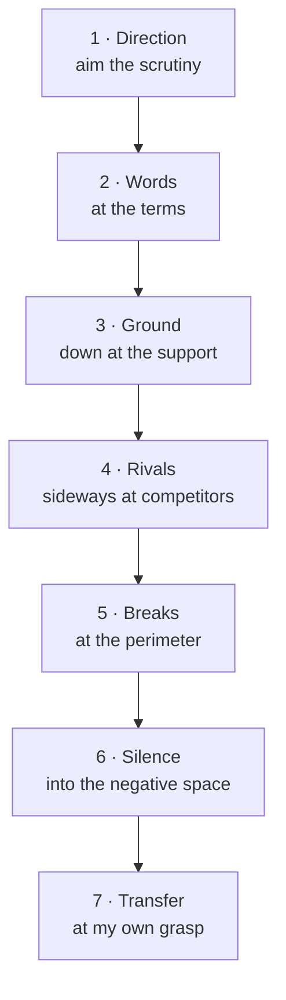

# The anti-summarization pass

> 盡信書不如無書 — to wholly trust the book is worse than to have no book. (孟子《盡心下》)

A summary is a compression, and compression is where rigor leaks. The naked digit loses its
denominator; "often, under X" rounds up to "always"; a tentative claim from an interested secondary
source ends up in the same typeface as a hard primary fact.

The damage has one property that governs the whole design: **it is invisible from inside the
summary.** What compression removed is, by definition, not in the text you are now reading. So a
question asked *of the summary* — "what is missing?" — returns "nothing I can see," tautologically,
because the missing material is precisely what got smoothed out. A pass built from such questions is
a mirror: it reflects the distillation's fluency back and calls it rigor.

The doors below avoid that trap by two rules. Each is aimed at the **gap** between the summary and
the source (or the world), not at the summary. And each demands a **noun** for an answer — a
yardstick, a means of knowing, a named rival, a break-point, a missing item, a worked case.
"Nothing" is not a noun, so it is not an available answer, and producing any of those nouns forces
the reader back into the source.

This is a **reading discipline, not a gate**. peira enforces obligations on a claim graph with no
model in the loop; these questions are asked *by* a reader distilling a source, and several are
irreducibly judgement. Their lenses are therefore **catalogued, not enforced** (see the last
section). The pass is where the framework is *used*; the vault is where the claims that survive it
get recorded, checked, and made citable.

---

## The seven doors

The count is not a preference — it falls out of the number of distinct *kinds of looking* a reader
can perform. Five of them face the source: at its **words**, down at the **ground** beneath a
claim, sideways at its **rivals**, at its **perimeter**, and into its **negative space**. One faces
the reader (**Transfer**), and one aims the whole exercise before it starts (**Direction**).

| # | Door | The question | Routes to |
|---|---|---|---|
| 1 | **Direction** | Which way do I want this to come out, and which way hurts more if I'm wrong? | `BLACKSTONE`, `IDOLA` (bias) |
| 2 | **Words** | What is the yardstick, and do the words hold still? | `CRITERION`, `RECTIFY-NAME`, `SUBSTANCE-FUNCTION` |
| 3 | **Ground** | How does it know, and can that way of knowing reach this far? | `TOULMIN`, `MEANS-OF-KNOWING`, `RUNG` (causal), `NON-PERCEPTION`, `PEIR-LINT-ORPHAN-CLAIM`, `PEIR-LINT-UNGROUNDED-CHAIN`, `PEIR-LINT-FALSE-INDEPENDENCE` |
| 4 | **Rivals** | What else would look exactly like this, and who got left out of the ring? | `ACH`, `THREE-MARKS`, `FOUR-CORNERS`, `STEELMAN`, `PRESERVE-MINORITY` |
| 5 | **Breaks** | Where does it break — on its own pages, against the world, after a date, past a case? | `DUNG`, `SYNTHESIS`, `PEIR-BOUNDARIES-MISSING` (under `RUNG`), `WHITE-HORSE`, `PREMORTEM`, `THESEUS` |
| 6 | **Silence** | What should be here and isn't, and what was cut without a reason on record? | `LACUNA`, `CHESTERTON` |
| 7 | **Transfer** | Can I run it on a case the source never mentions? | `KNOW-BY-DOING` |

**The order is load-bearing.** Direction first, so the scrutiny budget is aimed before it is spent.
Words before Ground, because you cannot weigh support for a claim whose terms float. Ground before
Rivals, because a rival is "what else this same evidence would support," so the evidence must be
pinned first. Breaks after Rivals, because a perimeter is easier to find once the competitors are in
view. Silence late, because negative space is visible only after the figure is fully seen. Transfer
last: it is the exit exam, the one door that can still fail after the other six look clear — which is
what makes it the pass's defence against its own fluency.

Two doors do more than list sub-checks:

- **Direction is one comparison, not two questions.** If the way I *want* it to come out is also the
  way that is *costlier* to be wrong, my motivation is aiming me at the expensive mistake. That
  interaction is the finding; the two halves are read together or not at all.
- **Breaks is one motion at four loci.** Internal contradiction, clash with the world, staleness
  after a date, and failure past a case (the forced universal, the claim with no stated limit, the
  claim nothing could defeat) are all *"where is the failure point"* — asked once, across four
  places.

---

## The noun-demand

Every non-empty answer is a **noun**, and the noun names where it was found: a *yardstick* (the
standard a judgement is made against), a *means of knowing* (how a claim was established), a *named
rival* (what else the evidence fits), a *break-point* (where it stops holding), a *missing item*
(what a competent treatment would contain), a *worked case* (an unseen instance carried through).

This is the forcing function. "Some parts are complex" names nothing; "the term *execution* carries
two yardsticks — process creation on p.4, and cataloguing on p.9" names something, and could only be
written by reopening the source. A door that can be satisfied with the source closed is not doing
the work.

**A "none found" is itself an absence claim** — the pass's own `NON-PERCEPTION`. Write it as *"searched
[where] for [what], found none,"* never as a bare "nothing here." Door 3 (Ground) applies to the
doors' own answers.

---

## Two species, stamped per finding

Doors 2–6 are all asked with the source open, so the species is not a property of the door — it is a
**stamp on each finding**, set by one test: *is the defect present in the source as written?*

- **`[SOURCE FAULT]`** — yes; the material contradicts itself, asserts without evidence, omits,
  leaps. A **finding**. In the graph, an attack or contradiction edge on the source node.
- **`[MY LIMIT: compression]`** — no; the source had it and my distillation dropped it. A **task**.
  In the graph, an open `Question` node or an unassessed / low-grade edge.

The same symptom carries different owners: *"no rivals named"* is a `[SOURCE FAULT]` if the source
never named them, and `[MY LIMIT: compression]` if it did and the summary lost them. This is
[`claim-grading.md`](claim-grading.md)'s axis applied to distillation — `[QUOTED]` is a fact about a
document, `[OBSERVED]` a fact about the world.

**"What did I smooth over for fluency?" gets no door, deliberately.** Asked introspectively it always
returns "nothing," because smoothing is by nature the thing you did not notice doing. It is
discoverable only by comparison — as the `[MY LIMIT: compression]` stamp on doors 2–6, and as a
failure at Transfer, where what I flattened is exactly what I cannot apply. Giving it a door would
give it a comfortable exit.

---

## The guardrail is peira's controlling idea

A richer question set risks each door earning a fluent "nothing here" until the ceremony defeats the
fluency it was built to fight. The noun-demand blocks most of that; the rest is
[`README.md`](README.md)'s controlling idea, made a rule of the pass:

- **An all-empty pass is a tell of a *skipped* pass, not a flawless source.** On non-trivial
  material, empty across every door means re-run, not celebrate — the same reason a `GateResult` is
  never silently a `Pass`, and every zero is a possible instrument failure until the instrument has
  fired on a known positive. Here the instrument under suspicion is the reader.
- **Default to "not established."** The pass reports what has *not* earned belief as prominently as
  what has, and a negative finding stays in even when it is inconvenient.

---

## Why seven, and where the five went

The pass began as five questions — *what is unclear / what conflicts / what is missing / what are
you assuming / what could change your conclusion* — which circulate in two language versions that
differ in two places (one adds the omission question, the other keeps ambiguity as its own; one asks
what would *confirm*, the other what would *falsify*). Both were adopted, then found wanting for one
reason: **every one of the five can be answered with the source closed.** They are questions about
the summary, and the summary cannot report what compression removed.

The seven doors are what the five become once each is re-aimed at the gap and split along its real
seams:

- **Not fewer.** Merging two *different-motion* doors makes the second get rubber-stamped: fold
  Rivals into Breaks and the reader finds one contradiction, feels done, and the confound is never
  named. The original five have no Words door and no Rivals door, and between them those two orphan
  the largest class of failure in the set.
- **Not more.** Every candidate eighth door was a *sub-locus* of an existing motion — staleness is
  Breaks-after-a-date, a falsifier is Breaks-past-a-case, an absence-claim is Ground applied to a
  negative. Sub-loci belong on a door's prompt line, not as new doors, because each new door dilutes
  the run-rate of all the others. Seven is the ceiling of what gets run every time rather than
  skimmed.

The five survive as a mnemonic; the seven are the working doors.

---

## The two tiers, and why the new lenses sit where they do

peira distinguishes what it **enforces** (deterministic gates over the graph) from what it
**catalogues** (named, sourced, given a worked example, owning no gate — a reading list for what to
ask by hand). See [`README.md` §"What peira actually enforces"](README.md).

The four lenses this pass adds — `KNOW-BY-DOING`, `LACUNA`, `IDOLA`, `BLACKSTONE` — are **catalogued, not
enforced, and deliberately.** *What did I smooth over*, *what would a competent treatment contain*,
and *which error is costlier* cannot be settled without judgement, and a gate that pretended to
settle them would be the ceremony peira exists to refuse — its meta-test asserts that a catalogued
lens owns no gate, precisely so the catalogue cannot imply an examination it does not perform. The
enforceable half of each door already lives in the enforced set the routing points to: a warrant, a
falsifier, a declared extension, a source-class ceiling. The pass asks all seven questions; peira
mechanises the part of the answer a machine can honestly check.
