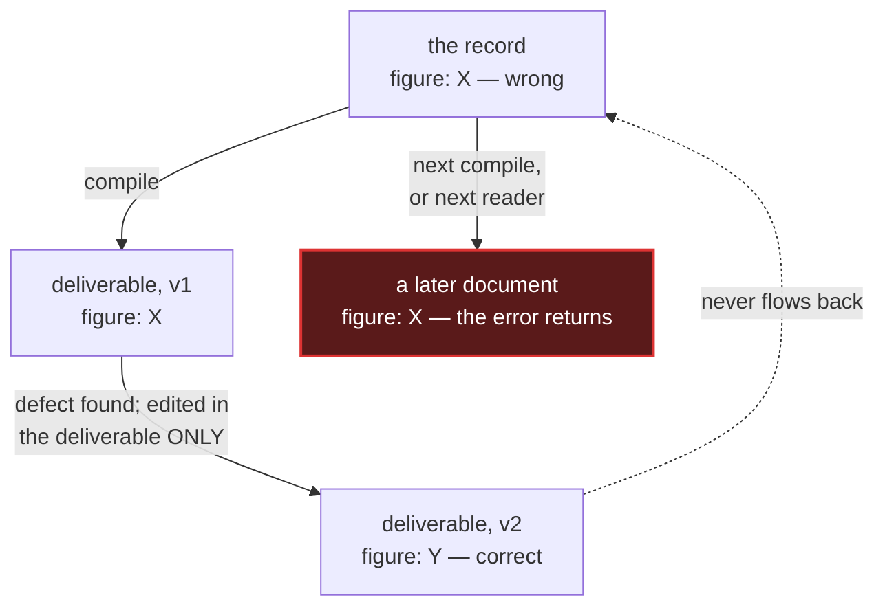

# Claim grading — the normative standard

Keywords **MUST**, **MUST NOT**, **SHOULD**, **MAY** are normative.

Written because an untagged file of accumulated conclusions is the most dangerous artefact in a
long-running matter: it reads like evidence, is treated like evidence, and is neither. Every entry
was someone's conclusion on a day, under assumptions that may since have failed, and nothing in the
file records which.

---

## 1. How a claim is known

Every substantive claim **MUST** carry exactly one tag from the first group, and **MAY** additionally
carry a state from the second. They are **orthogonal axes** — a claim can be quoted *and* unverified
at once, and a scheme that forces one tag makes you drop a fact to satisfy it.

### Means of knowing — authored

| Tag | Means | Relied on unchecked? |
|---|---|---|
| `[OBSERVED]` | read directly from the system, with method and instant stated | **yes** — the only one |
| `[QUOTED]` | taken from an earlier document. A fact about *that document*, never about the world | no |
| `[INFERRED]` | a conclusion drawn from evidence, not something the evidence shows | no |

### State — derived, never authored

| State | Means |
|---|---|
| `[UNVERIFIED]` | carried forward, never independently checked. A lead, not a fact |
| `[NOT ESTABLISHED]` | tested and not answerable by the method used. A **result**, not a gap |
| `[WAS-UNVERIFIED — CLOSED]` | formerly open, since resolved; retained for audit only |

**peira separates the two axes but does NOT implement these tags.** An earlier draft of this
document claimed the first axis "rides on the edge as `pramāṇa`" and the second "is computed". Both
halves were false and are retracted. `Pramana` has four values — perception, inference, comparison,
testimony — not the three tags above, and it is optional on an edge; nothing requires a claim to
carry one. The states peira computes are `review_ready`, `contested` and `evidence_pending`, none of
which is `[UNVERIFIED]`, `[NOT ESTABLISHED]` or `[WAS-UNVERIFIED — CLOSED]`.

What peira does share is the *shape* of the separation: how a claim is known is authored on the
edge, and its standing is computed — there is no `status` field, and the parser refuses a document
carrying one. **Tag your claims by this standard in your own prose; the tool will not do it for
you, and will not check that you did.**

### Rules per tag

**`[OBSERVED]`**
- **MUST** state the method and the instant. A bare number implies *now*.
- **MUST NOT** be attached to a sentence containing a conclusion. *"41 logs returned"* is observed;
  *"which refutes the defeater"* is inferred. Split the sentence.
- A figure produced by a tool is observed **only if the tool's failure mode is known** (§4).

**`[QUOTED]` — the tag that bites**
- *"The earlier report says X"* and *"X"* are different claims. Notes collapse them; this tag exists
  to stop that. Anything quoted forward as though observed has **laundered a citation into a
  finding**.
- **MUST** be re-derived rather than trusted whenever the underlying system retains history — a
  database at a past timestamp, a chain at a past block, a VCS at a past commit.

**`[INFERRED]`**
- **MUST** name its defeater where it is stated. An inference with no stated defeater is not
  gradeable and **MUST NOT** be recorded. *(peira: `PEIR-FALSIFIER-MISSING`.)*
- **MUST NOT** inherit silently. If inference B rests on inference A, say so.
  *(peira: `PEIR-LINT-UNGROUNDED-CHAIN` catches the extreme case — a claim whose support never
  reaches an observation.)*

**`[NOT ESTABLISHED]`**
- Reserve for questions **tested and found unanswerable by the method used**. Distinguish sharply
  from `[UNVERIFIED]` (untested) — collapsing them hides work that was done.
- **MUST** say what would establish it, if anything would.

---

## 2. Independence tiers — who confirms it

Grading the tag is not enough; grade the **independence of the confirmation**.

| Tier | Definition |
|---|---|
| **T1** | an independent third party authored both the artefact and the answer key; or real-world data |
| **T2** | real tool output with ground truth derivable from documented construction, or confirmed by an independent oracle — genuinely checked, but you chose the scenario |
| **T3** | you authored both the fixture and the expected answer — **circular** |

- **An oracle is independent only if its LINEAGE is.** Two checkers vendoring the same dependency are
  not independent for the shared layer. Two agents from one model family share a blind spot and count
  as **one method**.
- **MUST** label T2/T3 explicitly. Letting T3 read like T1 is the core dishonesty this prevents.
- T3 remains legitimate for: your own detection heuristics, robustness and negative tests, and
  adversarial edge cases real corpora lack.

### The two-method rule

A figure not reproduced by a **second, differently-shaped** method **MUST** be reported with that
caveat attached. **Two methods that share a blind spot are one method.**

---

## 3. Source classes

Distinct from tier, because a reader needs to know *what kind of thing* was consulted.

| Class | Reporting requirement |
|---|---|
| **Primary — system of record** | state method **and instant** |
| **Primary — official** | cite identifier and locator |
| **Secondary — reputable** | **MUST** be attributed: *"X tags this as Y"*, **never** *"this is Y"* |
| **Self-asserted** | **MUST** state the direction of the assertion and whether it runs both ways |
| **Inherited working file** | **MUST** disclose that completeness was not re-established |

**Self-asserted claims deserve their own test: does the other side assert it back?** An identifier
claiming a person, where the person never claims the identifier, is a **moderate-confidence lead, not
an identification**.

---

## 4. Instrument validity — a result is only as good as the detector

A claim **MUST NOT** be recorded from a detector whose failure mode is unknown.

1. **Positive control.** The detector **MUST** be shown to fire on a known positive before a null is
   believed. *"0 of 21"* means nothing until the test flags a case it should.
2. **Negative control.** It **MUST** be shown not to fire on a known negative.
3. **Refusal ≠ zero.** A failed, refused or rate-limited query is **UNMEASURED** and **MUST** be
   counted separately from a genuine zero.
4. **Saturation is self-description.** A detector firing on ~100% or ~0% of inputs is describing
   itself. Investigate the instrument before reporting the result.
5. **Truncation bias.** A capped or paged walk yields a **floor**. State which direction the cap
   biases the conclusion; a floor can support *"broad"* and can never support *"narrow"*.
6. **Symmetric truncation hides itself.** If a cap trims inflows and outflows equally, in still
   equals out and the set looks complete. Assert full pagination and print record counts.

Where a source has been *observed* failing silently — answering successfully with the wrong
thing — that observation **MUST** be recorded in the matter's source register, which has its own
rules of ownership and expiry: see [`source-register.md`](source-register.md). In peira, the
register entry is an `instrument` node and the observation names it with a `measured_by:` edge —
expressible today, enforced by nothing.

### Verdict gating

A conclusion **MUST** be gated on its diagnostic, not merely followed by it. Printing a verdict and
then printing the confound that invalidates it is a defect: readers take the verdict and skip the
diagnostic. Compute the confound first and let it **suppress** the conclusion.

### Before aggregating

Sub-estimates **MUST** be checked for mutual consistency before being averaged. If per-period
intervals are mutually exclusive they are not noisy measurements of one quantity, and their mean is
an artefact. A statistic **MUST NOT** be compared across sets of different size unless it is
size-robust.

---

## 5. "Derived" is a claim too

The instinct that a computed figure is safer than a typed one is **wrong often enough to be
dangerous**: a wrong derivation ships with the authority of provenance and is harder to spot than a
wrong literal. A derivation asserts three things, each falsifiable while the code runs perfectly:

| Failure | Mechanically catchable? |
|---|---|
| the selector picked the wrong rows | **no** |
| the selector matched nothing | only with an explicit non-zero assertion |
| the source's scope is narrower than the claim | **no** |
| the objective function hides an unstated preference | **no** |

- **Select on an identifying property** — an id, an address, an event type — never on a magnitude
  threshold or an ordering that merely *tends* to pick the right row.
- **A selector matching zero rows MUST throw.** Empty-to-default is refusal-counted-as-zero one layer
  up.
- **The variable name is a claim.** Name what the code does, not what you hope it selects.
- **A figure outside its plausible range is a DEFECT SIGNAL, not a finding.** State the range you
  expect before you read the number.
- **A number spelled as a word is invisible to a numeric provenance gate.** *"Two were sent by its
  own key"* is an unverified count in disguise. Derive the word from the count.

---

## 6. Confidence expression

Confidence **MUST** be expressed in words tied to evidence, not as a bare percentage.

| Level | Warrant | Permitted phrasing |
|---|---|---|
| **Established** | observed, T1/T2, instrument validated, two methods | "is", "shows", "reads" |
| **Strong** | inferred from observed facts, defeaters tested and failed | "is strongly consistent with" |
| **Moderate** | inferred, defeaters named but untested | "is consistent with" |
| **Lead** | unverified, or a single secondary source | "is reported as", "would need" |
| **Negative result** | not established after a valid test | "is not established by X" |

### Forbidden upgrades

*(peira: `PEIR-LINT-FORBIDDEN-VERB` — it scans a node's title and body, and separately reads the
FINISHED packet body before sealing, so the warrant, the boundaries and a term's moments are
covered too. The falsifier section is deliberately excluded: it names what would defeat the claim,
and scanning it refused the disclosure the gates demand.)*

| Overstatement | Correct form |
|---|---|
| "confirms X" | "is consistent with X" |
| "proves X" | "establishes / provides evidence of X" |
| "is consistent only with X" | "is strongly consistent with X" |
| "contradicted by" | "is not consistent with" |
| "conclusively", "definitively", "beyond doubt" | delete — say what the evidence shows |

### Universal quantifiers

*"every"*, *"all"*, *"none"*, *"never"*, *"anywhere"* **MUST** be scoped to what was actually
queried. *"No footprint anywhere"* is false when six sources were probed and others exist.
*(peira: `PEIR-CLASS-EXTENSION-UNDECLARED` — which reaches a verdict only when the claim declares
`quantifier:`. An undeclared one no longer vanishes: it reaches no verdict, and no verdict blocks
as `PEIR-GATE-UNASSESSED`.)*

### Extreme values

A universal negative or a 100% result **MUST** be re-derived by a second, differently-shaped method
before reporting. Populations rarely agree perfectly; such a result more often measures the
instrument than the world.

### Two failures of the opposite polarity

- **Asserting intent from behaviour.** *"These ARE the actions of someone X"* claims a state of mind
  from a record that holds none. Write *consistent with*. The same applies to *in order to*,
  *chose to*, and *deliberately*.
- **Over-hedging an OBSERVED fact distorts as much as over-claiming an INFERRED one**, and is harder
  to spot because it reads as caution. A fully traceable disposal carried as *"destination
  unattributed"* weakened a finding that was sound. Separate the observed identity from the inferred
  operator rather than hedging both.

---

## 7. Hygiene of the record

- **Re-read before you research.** Before investigating any open item, the matter's own documents
  **MUST** be searched for it. The failure mode is never *"no evidence"*; it is *"did not re-read
  evidence in hand"*.
- **A live marker MUST NOT appear inside a closed entry.** If one marker serves both a state and the
  history of that state, **any tally of it counts the editing history, not the work**. Use a distinct
  retired marker, and keep the authoritative count in a single register with a warning at its head
  not to derive one by search.
- **Correct at the point of use.** A correction **MUST** be recorded where the stale figure appears,
  not only in a later section.
- **A windowed query returns a true fact about the window.** Its edge **MUST NOT** be read as the
  start of a behaviour. *(peira: `PEIR-LINT-WINDOW-EDGE-AS-ONSET`.)*

---

## 8. One source of truth — deliverables are compiled from it

The knowledge base is the source; every report, chart, table and memo is a **build artifact**.
Treat it exactly as source code is treated: nothing is written straight into a report, and nothing
is fixed only in a report.

The failure this prevents is fast, not hypothetical. A wrong figure gets found, corrected in the
deliverable, and left standing in the record — the same fact, two values, within the hour. The
stale copy is the dangerous one, because it reads as the record and gets inherited:

The discipline, in the order it must happen:

1. **Record before you report.** Every finding, correction and retraction **MUST** land in the
   knowledge base, with its tag, before it appears anywhere else.
2. **Correct at the source, then rebuild.** A defect found in a deliverable is a defect in the
   source. Fix it upstream and regenerate — never patch the output alone. **Search the record for
   the superseded figure and supersede it explicitly**: a correction that does not reach its copies
   is barely a correction.
3. **Mark supersession; never silently overwrite.** Record what was wrong and what produced it. The
   retraction is more valuable than the correction — it is the only record of a failure mode you
   are otherwise going to repeat.
4. **The deliverable is a projection, not the whole.** Know everything; report only what answers
   the question asked. The record is a superset by design.
5. **If it cannot be regenerated, it is not compiled — it is a fork.** A hand-edited deliverable
   has silently become a second source of truth.

### The mechanical form

peira is this section as machinery, and the mapping is exact where it holds:

- **Record before you report** — a packet has no prose write path: `peira packet` renders it from
  the graph, and the parser refuses a hand-written `status:` or `confidence:` at the front door.
- **Rebuild, and prove the rebuild** — `peira verify` re-derives the packet from the vault as it
  stands and compares digests. An edit that reaches the rendered body surfaces as
  `DigestMismatch`; one confined to fields the packet does not render — a grade, a grader, an
  instrument link — changes no digest. A `by=` edit does move it: the packet renders who is credited. *"The rendered projection agrees with the record"* becomes
  a build step — that far, and no further (architecture defect 8).
- **Projection** — a packet renders a fixed subset: titles of direct supporters, contradictors and
  limiters, the warrant, boundaries, falsifiers and term moments. The vault stays the superset.

And this one the tool now honours: a `retracts:` or `supersedes:` edge is reported by
`PEIR-LINT-RETRACTED`, and because `freeze` refuses while any violation is attributed to the claim,
**a retracted claim can no longer be frozen into a packet.** The remedies differ by kind —
retraction says cite it or delete the claim; supersession says cite the newer version.

Two limits worth stating. Neither edge is an *attack*, deliberately: a retraction is a lifecycle
fact, not a dialectical move, and modelling it as one would let a claim defeat its own withdrawal in
the grounded extension. And **packets frozen before a retraction do not know about it** — the
digest covers what was rendered, and a retraction that arrives afterwards is invisible to a packet
already in someone's hands. Withdrawing a claim still means retrieving the artifacts that cite it. See the
[architecture defect register](../architecture.md#defect-register), defect 3.

---

## 9. Deliverable rules

1. Every figure **MUST** trace to an artefact or a declared source. Prose-embedded numbers defeat
   this; declare them in a data block with a source string.
2. Two documents on one matter **MUST NOT** carry different totals for the same quantity without an
   explicit statement of why.
3. Where components are read at different instants, the deliverable **MUST** disclose the gap.
4. Identifiers — addresses, hashes, GUIDs — **MUST** appear in full. Never elide within a value.
5. Findings that were tested and abandoned **SHOULD** appear. A report listing only what survived
   gives a false impression of how reliable the remainder is.

### Responsiveness

**Investigate exhaustively; write selectively.** A sentence that is true but not responsive is not
harmless padding — it answers a question the reader did not ask, and they will draw a conclusion from
it anyway. Name the question each sentence answers; if you cannot, find out which one it is answering.

Three things stay in regardless, or the rule becomes a licence to omit: **scope limits**, **contrary
evidence**, and **what is not established**.

---

## 10. Review

- The author of a finding **MUST NOT** issue its final sign-off.
  *(peira: `PEIR-LINT-SELF-GRADED`.)*
- A reviewer given prior findings will **restate rather than re-test** them unless instructed to
  refute. Review instructions **MUST** direct the reviewer to attack, and **MUST** be scoped to one
  claim where the finding matters.
- **Verify the critic.** A hostile reviewer overstates too. Reviewer findings are `[QUOTED]` until
  checked.
- **Repeated review rounds each finding new defects is a diagnostic, not bad luck** — the reviews are
  sampling a population nobody enumerated. Switch to a census with a stated denominator, classify
  every member, and audit it with a *differently-shaped* extraction.
- A run that returned nothing has not necessarily done nothing: check the tool's own transcript
  before declaring failure.
