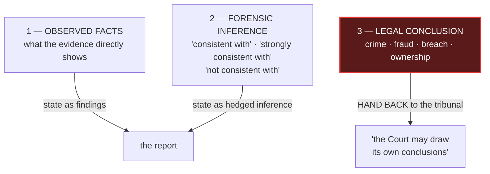

# Reporting to a tribunal

peira's Court Mode exists because of what is in this file. If you are not producing evidence for a
tribunal you can skip it — but the three-layer rule is worth reading anyway, because collapsing the
layers is the most common way a technical report overstates.

---

## Three epistemic layers — never collapse them

Layer 3 is **never** the expert's. Layer-3 overreach concentrates in **callout boxes, opinion
summaries and section conclusions** — review those first, because they are where a hedge gets dropped
for punchiness.

peira mechanises the layer-1/layer-2 boundary as the causal ladder gate
(`PEIR-CAUSAL-RUNG-UNREACHED`) and the substance/function gate (`PEIR-FUNCTION-AS-SUBSTANCE`). It
does **not** detect layer-3 overreach — that remains a human obligation.

---

## The substitution table

| Overstatement | Correct form |
|---|---|
| "confirms X" | "is consistent with X" |
| "proves X" | "establishes / provides evidence of X" |
| "is consistent only with X" | "is strongly consistent with X" |
| "contradicted by" | "is not consistent with" |
| "establishes that P was victimised" | "is consistent with P having been victimised" |
| "does not belong to D1" | "has no established relationship with D1's known identifiers" |
| "this is not a matter of dispute" | remove — that is for the tribunal |
| "X is confirmed active and targeted" | "X activity confirmed; the pattern is consistent with targeting" |

**Never make a definitive negative ownership finding from absence of a connection.** *"No
relationship found"*, not *"is not D1's"*. **Never state a party's witness-statement fact as your own
finding** — attribute it.

---

## The principle of least disclosure

Answer with the **bare minimum information that fully and honestly answers the question**. Every
additional word, category, qualifier or volunteered detail is surface a cross-examiner can probe, or
use to define a limit you did not intend.

- **Do not enumerate the scope of a check.** *"I checked clients, employers and relationships"*
  invites *"so you did not check X?"*. Say *"I have checked the names provided against my records"* —
  broad, complete, not self-limiting.
- **Do not assert more than the question asks.** A conflict check asks whether you have a conflict.
  It does not ask you to certify *"no prior relationship of any kind"* — a different, broader and
  falsifiable claim.
- **Do not explain reasoning you were not asked for.** Volunteered rationale becomes a target.
- **State each thing once.** Duplicated assertions drift apart across drafts and hand a
  cross-examiner two phrasings of one fact to compare for discrepancy.

### The hard limit: least disclosure is not concealment

It governs *words about process and scope*. It is overridden, absolutely, for two things that
**MUST** be disclosed fully and early:

1. **Any conflict or connection that is not obviously immaterial.** Do not decide materiality
   yourself — disclose it and let the instructing party assess. **Non-disclosure is what destroys an
   expert, not the connection itself.**
2. **Any fact, limitation or assumption bearing on the opinion.** Candour to the tribunal is the
   overriding duty.

Minimal words about *how* you work; hide nothing about *what affects the opinion*.

---

## Conflicts

A prior relationship does **not** automatically disqualify an expert. The test is the independence of
the opinion, judged by materiality — see *Toth v Jarman* [2006] EWCA Civ 1028. **Non-disclosure is
the killer**: an undisclosed past association surfacing in cross-examination gets the evidence given
greatly reduced weight or ruled inadmissible — see *EXP v Barker* [2017] EWCA Civ 63. (English
authorities; the principles travel to other common-law jurisdictions and to arbitration.)

Answering a conflict-check request:

- **Anchor on the real test** — no conflict *"actual or apparent, that would affect my independence
  or impartiality"*. Not *"no prior relationship"*, which is the wrong test and a hostage to fortune.
- **Show a real check without itemising it.**
- **Affirm the overriding duty** to the court or tribunal.
- **Make it as-at-date, with a continuing duty** to disclose anything arising later.
- **Keep the artefact.** The defensible thing later is the dated record, not the bare assertion.

---

## Why the packet is generated, not written

The obvious design is to let someone write the courtroom sentence and check it against the evidence.
That check is impossible to do well: natural language overstates in ways no matcher catches, and the
person who wrote the sentence is the last one able to see it.

peira inverts it. The safe statement is **rendered from the graph** in the 金剛經 three-moment form —
*what is called X*, *X is not the thing itself*, *it is named X under these conditions*. Nobody
writes the sentence, so nobody can overstate it.

**A known limit, from an adversarial audit:** the rendered statement quotes author-written term
fields verbatim, so an overstatement placed in a term's stipulation reaches the packet unaltered, and
the forbidden-verb lint does not scan those fields. See [`../architecture.md`](../architecture.md).
The generation is a structural defence, not a complete one.

---

## Before anything leaves your hand

- Does it answer the exact question and nothing wider?
- Any enumerated scope or categories that define a limit? Cut them.
- Any volunteered reasoning not asked for? Cut it.
- Any assertion made twice in different words? Reduce to one.
- Any not-obviously-immaterial connection, or opinion-bearing fact or limitation? Disclose in full.
- Inferences hedged, legal conclusions handed to the tribunal?
- Every identifier written in full, never elided?
- Dated, and filed in the record?
