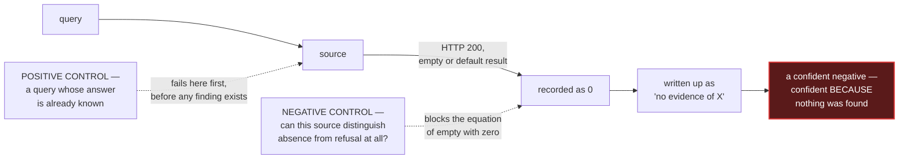

# Sources that fail silently — keep a register

A source that refuses loudly is a nuisance. A source that **answers successfully with the wrong
thing** is the main manufacturer of false negatives: an HTTP 200 carrying an empty array; a pruned
node reporting itself healthy while its history starts after the period you asked about; a
rate-limit refusal a client library renders as an empty result; an interstitial challenge page
served with status 200; a price endpoint that defaults to 0.00 on failure — and thereby *confirms
the very hypothesis it was written to test*.

None of these look like failure at the call site. Each returns a well-formed value that a pipeline
records as a finding, and the finding is confident *precisely because* nothing came back.

---

## The mechanism, and where the controls cut it



The universal control is the pair: a **positive control** whose answer you already know, run
against the same source with the same expression as the real query, and a **negative control**
proving the source can distinguish *absence* from *refusal* at all. A source that returns the same
shape for "nothing exists" and "I could not look" cannot support a negative finding, whatever it
returns.

---

## Three owners, so the copies cannot drift

Knowledge about failing sources decays at three different rates, and the standing error is to keep
all three kinds in one document — where the fast-decaying parts silently date the durable ones.
Split the ownership:

| What | Belongs to | Why there |
|---|---|---|
| The **reasoning** — refusal is not zero; positive and negative controls; truncation yields a floor | the discipline documents in this directory, stated once | it does not decay, and a second copy of it drifts |
| The **behaviour of a named product** — caps, headers, error shapes, retention windows | the register | it decays and must be re-tested; a register row is designed to expire |
| The **lived consequence** — which wrong figure a silent failure manufactured | the matter that recorded it | it is evidence about that matter, not a property of the vendor |

Two rules travel with the register wherever it is kept:

- **Absence from the register means "not yet observed failing", never "safe".** A source enters
  the work by passing its own controls, not by being missing from a list.
- **Every row is a fact about a date, not a standing property of a vendor.** "Endpoint E returned
  an empty 200 for a dormant subject on such-and-such a date" stays true forever; "endpoint E is
  unreliable" was never a fact at all.

### What a row records

Source and endpoint; the date observed; what was asked; what came back, verbatim; the shape of the
failure (empty-as-refusal, default-as-failure, truncation, interstitial-as-200, retention
boundary); and the control that now catches it. A row without the offending response verbatim is a
warning nobody can re-test.

---

## Where this lives in peira

A per-matter register is exactly what the `instrument` node kind and the `measured_by:` edge are
for. An instrument is a detector an observation came off — a tool, a query, a procedure someone
else's software performs. It is reference material: it never competes in the grounded extension,
it qualifies what does. Recording the register as instrument nodes means the instrument's history
**travels with the evidence it produced** — every observation that names its instrument is one
`measured_by:` edge away from that instrument's known failure shapes.

An obviously invented example:

```markdown
---
id: i-examplefeed
type: instrument
title: ExampleFeed price endpoint
positive_control: returns a nonzero price for a major listed asset at a known past date
negative_control: returns an explicit error, not 0.00, for an asset it does not list
observed_failing: 2026-08-01 — returned 0.00 with HTTP 200 for an unlisted asset
---
```

```markdown
---
id: o7
type: observation
title: No market price found for the asset on the capture date
measured_by: [i-examplefeed]
---
```

**Be clear about what is and is not enforced.** The loader builds the `measured_by:` edge and the
instrument node parses like any other — and that is the whole of it. There is currently **no
enforced check on instruments**: nothing requires an observation to declare `measured_by:`,
nothing requires an instrument to record a positive or a negative control before its observations
are relied on, and nothing counts refusals separately from zeros. The dangling-edge lint
(`PEIR-LINT-DANGLING-EDGE`) will catch a `measured_by:` pointing at a node that does not exist,
because it catches every dangling edge; no check is specific to instruments.

What the vault gives you today is an **address** — a place where the register lives next to the
evidence, in the same graph, queryable through the derived index (`peira index` stores every field
and edge, so "which observations rest on an instrument with no recorded positive control" is a SQL
query). The discipline of running the controls, and of refusing a negative finding from a source
that has not passed them, is yours to keep by hand. §4 of
[`claim-grading.md`](claim-grading.md) states the normative rules; this page is where their
subject matter — the sources themselves — gets written down.
